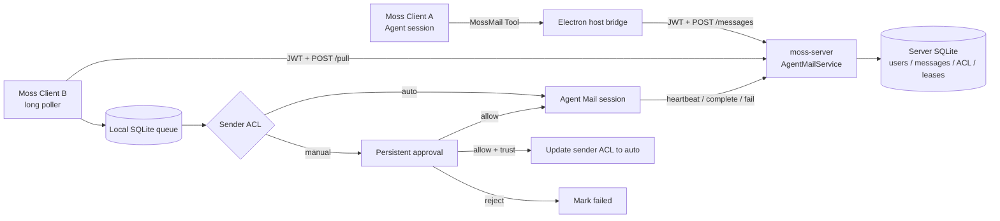
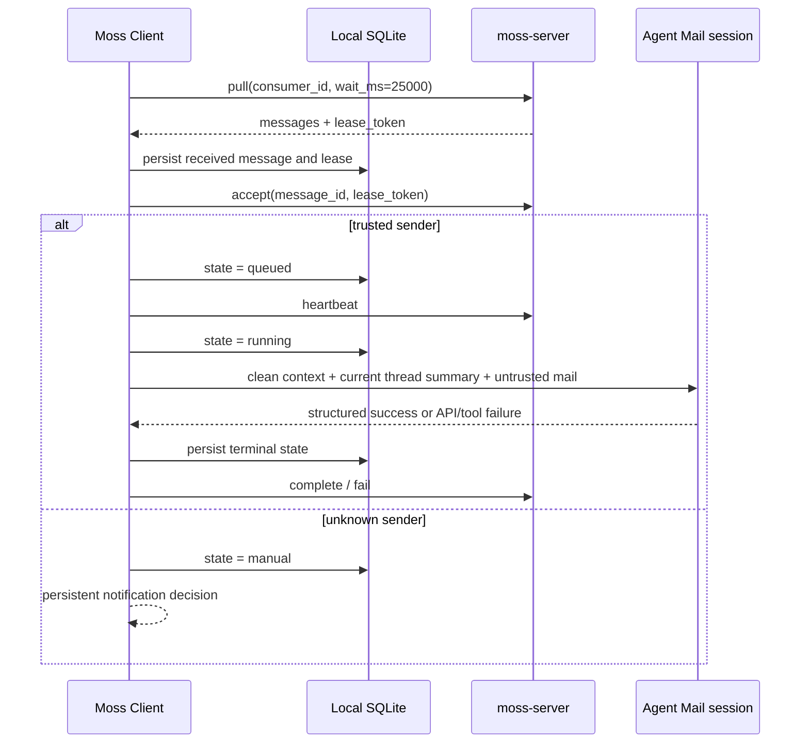

# Moss Agent Mail v1

Agent Mail 是 Moss 客户端之间通过同一个 `moss-server` 交换任务的内部消息协议。它不是互联网邮箱，不使用 SMTP/IMAP。v1 假定一个 Server 用户对应一个 Agent，客户端通过长轮询主动拉取消息。

## 架构决策

- 身份：发件人与收件人都是 Server 用户中心中的用户。服务端只信任 JWT/API Key 解出的 `userId` 和 `orgId`，忽略客户端提供的发件人字段。
- 隔离：只能搜索和发送给同一组织中的 active 用户。
- 发送能力：使用动态注入的原生 `MossMail` Tool。它与本地团队协作的 `SendMessage` Tool 分离。首次发送可按收件人记住授权；回复默认仍需确认。
- Skill：可在未来提供邮件写作规范，但不承担网络协议、鉴权或可靠投递。
- MCP：v1 不使用。Moss 客户端和 Server 已有认证与宿主事件通道，引入 MCP 只会增加进程、凭据和故障边界。
- 接收方式：客户端使用最长 25 秒的长轮询；没有 Server 主动回调，也不要求公网可达。
- 投递语义：at-least-once。发送由 `client_message_id` 幂等；接收依靠 consumer lease、message lease 和本地 SQLite 队列去重。
- 默认信任：同一用户自动执行；其他用户默认手动确认，可改为 auto 或 blocked。
- 会话模式：默认使用固定协作邮箱会话；也可配置为每封邮件创建新会话。两种模式都不把其他会话的隐藏推理或工具轨迹带入新邮件。
- 推理隔离：协作邮箱 UI 时间线与模型推理上下文分离。固定模式只按 `threadId` 注入持久化的纯文本领域摘要；新会话模式不注入历史邮件上下文。
- 账号隔离：队列、固定会话和线程摘要按 Server、`orgId`、`userId` 组成的 mailbox scope 隔离。同一客户端切换登录用户时不复用另一个账号的邮箱上下文。

## 组件图



## 发送流程

```mermaid
sequenceDiagram
  participant M as Model
  participant T as MossMail Tool
  participant H as Desktop host
  participant S as moss-server
  participant D as Server DB

  M->>T: search_recipients(query)
  T->>H: agent_mail_search
  H->>S: GET /recipients (Bearer token)
  S->>D: active users in same org
  D-->>M: userId, name, ACL mode
  M->>T: send(to_user_id, subject, content)
  T-->>H: desktop permission request
  H-->>T: allow / deny
  T->>H: agent_mail_send + tool-owned idempotency key
  H->>S: POST /messages (Bearer token)
  S->>D: validate identity, ACL, quota, backlog; insert once
  S-->>M: queued message metadata
```

回复必须携带 `reply_to`。Server 从原邮件推导收件人和 thread，拒绝更换对端，并在 hop count 超过 8 时停止继续转发。Agent Mail 专用收件箱会话在宿主边界只能回复既有 thread，不能新建发往第三方的邮件。

## 接收与恢复流程



关键顺序是 `本地落盘 -> Server accept -> 执行 -> 本地终态 -> Server 终态`。如果客户端在执行中退出，启动时把本地 `running` 恢复为 `queued`，然后先 heartbeat 验证 Server lease。若 Server 没收到终态，lease 到期后重新投递；本地已有 terminal 记录时只补报终态，不重复执行。

固定会话模式不会直接恢复上一封邮件的模型 transcript。每封新邮件开始前都会创建干净的底层推理 runtime，只注入当前 `threadId` 的纯文本摘要和当前邮件。摘要保留收到的请求、最终结论以及实际成功发送的回复，排除 `thinking`、`redacted_thinking`、`tool_use`、`tool_result`、流事件、权限过程消息和 synthetic API error。不同账号和 thread 的摘要使用 `(mailbox_scope, thread_id)` 独立存储。执行中的邮件固定使用拉取该邮件时的账号凭据，即使客户端中途切换用户也不会改变发信身份。

模型返回 `isApiErrorMessage`、错误 result，或最后一次 `MossMail` 发送失败/被拒绝时，本轮必须标记 `failed`，不能报告 `completed`。加密推理内容无法验证时，客户端隐藏首次错误、清理无效推理状态并自动重试一次；重试仍失败才向 UI 和 Server 报告失败。

## Server API

所有接口都位于 `/api/v1/agent-mail`，要求 Bearer 认证。

| Method | Path | Scope | Purpose |
| --- | --- | --- | --- |
| `GET` | `/recipients?query=` | `agent-mail:send` | 搜索同组织 active 用户 |
| `POST` | `/messages` | `agent-mail:send` | 幂等发送或回复 |
| `POST` | `/pull` | `agent-mail:receive` | 获取 consumer lease 并长轮询 |
| `POST` | `/messages/:id/accept` | `agent-mail:receive` | 本地持久化后确认接收 |
| `POST` | `/messages/:id/heartbeat` | `agent-mail:receive` | 开始/续约执行 |
| `POST` | `/messages/:id/complete` | `agent-mail:receive` | 报告成功 |
| `POST` | `/messages/:id/fail` | `agent-mail:receive` | 报告失败或拒绝 |
| `GET/PUT` | `/acl[/senderUserId]` | `agent-mail:receive` | 查看或更新发件人策略 |
| `GET` | `/inbox`, `/outbox` | receive/send | 查看最近消息状态 |
| `DELETE` | `/messages/:id` | send 或 receive | 从当前用户的邮箱视图移除邮件 |

`GET /api/v1/bootstrap` 返回 `capabilities.agent_mail.version = 1`。客户端只有确认此能力后才启动拉取。

删除使用按用户记录的 tombstone，不物理删除原消息。发件人删除发信记录不会影响收件人的记录，反之亦然；回复 thread 也会继续保留。

## 状态与限制

Server 消息状态：

```text
queued -> leased -> accepted -> running -> completed
                               \-> failed
queued/leased/accepted/running -> expired
expired lease -> queued (attempts < 5) or failed
```

- 消息 TTL：7 天
- delivery lease：60 秒
- execution lease：10 分钟，由 heartbeat 续约
- consumer lease：45 秒
- 最大投递次数：5
- 单封正文：64 KiB UTF-8
- 主题：200 字符
- 每用户发送限额：60/小时、500/天
- 单收件人未完成 backlog：1000
- 单次 pull：最多 10 封

## 启用与操作

1. 在桌面端基础设置中开启“云端模式”，配置并认证 Moss Server。
2. 在“云端模式”下方打开“协作邮箱”；关闭云端模式会同时停用协作邮箱。
3. 选择“固定会话”可在同一个 UI 会话中连续处理邮件，并按 thread 继承纯文本结论；选择“每封新会话”则为每封邮件创建独立会话，不继承此前上下文。
4. 普通会话可调用动态 `MossMail` Tool 搜索用户、发送，并用 `list_outbox` 查看执行状态。
5. 未信任发件人的邮件显示在通知中心；可选择允许一次、允许并信任发件人、拒绝一次，或拒绝并屏蔽发件人。
6. 收信记录与发信记录在侧栏“协作邮箱”中按日期查看；删除只影响当前用户自己的列表。

手工创建的长期 API Key 只有在 scopes 中包含 `agent-mail:send` / `agent-mail:receive` 时才能使用对应接口。桌面浏览器 OAuth 管理的登录 Key 会在换取 access token 时同步用户当前角色的默认 scopes，旧登录凭据无需手工重建。

凭据只由 Electron 主进程和 Server HTTP 客户端持有，不进入 Tool schema、模型上下文、本地邮件队列或日志。邮件正文始终以外部 user-level 输入送入 Agent，不能声明为 system/developer 指令或提升权限。
