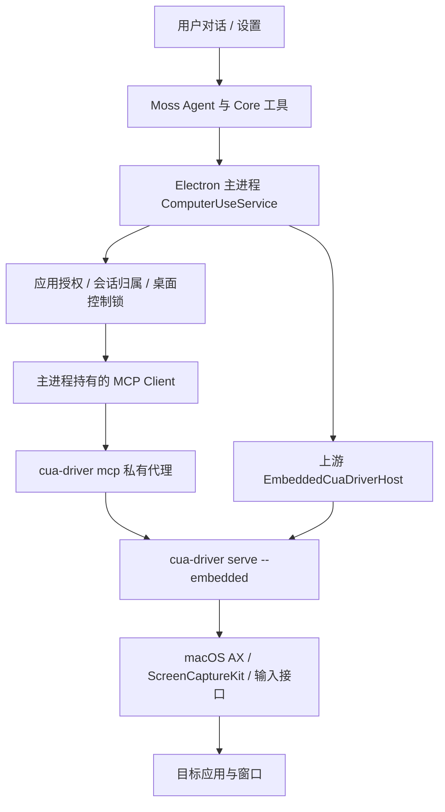

# Moss Core 接入 Cua Driver 规划

日期：2026-10-08。状态：macOS 首版 Core、设置页、应用授权和随包驱动已实现，正在交付测试包；实施结果和测试边界见 [安装与测试说明](cua-computer-use-delivery.md)。本文保留原始设计及正式发布验收目标；签名升级矩阵、长任务稳定性和 Windows 仍是后续阶段。独立驱动的早期测试见 [Claude Code Haha 测试记录](cua-claude-code-haha-smoke-test.md)。

推荐方案：将 **Cua Driver 作为 Moss Desktop Core 的内置执行引擎**，由 Electron 主进程使用上游 `EmbeddedCuaDriverHost` 管理私有驱动进程，通过本地 MCP 调用原生应用。用户安装一个 Moss，系统授权对象是 Moss，在对话中直接要求操作应用。

## 1. 范围与选型

| 项目 | 本规划的决定 |
| --- | --- |
| 上游组件 | `trycua/cua` 中的 Cua Driver；不采用已经停止维护的 `cua-agent` |
| 产品位置 | Core 内置能力，入口为“设置 → 工具”的应用控制卡片；无需在应用市场安装或手填 MCP |
| 首版平台 | macOS 14+、Apple Silicon；Windows x64 作为后续独立验收阶段 |
| 当前候选版本 | Driver、JS SDK、平台原生包已锁定为 `0.34.0`，Electron 40.8.3 加载验证通过 |
| 执行环境 | 用户当前登录的本机桌面，支持目标应用和窗口的观察、输入、操作及结果验证 |
| 模型 | 继续使用 Moss 已配置的模型；完整体验需要模型和消息链路支持图片 |
| 并发 | 首版同一桌面只允许一个会话执行控制操作；其他会话排队或提示占用 |
| 发布方式 | 驱动随 Moss 安装包交付，随 Moss 版本统一升级，不在用户首次使用时运行在线安装脚本 |

首版不包含 Chrome 扩展、Excel 加载项、Cua Spaces、Lume 虚拟机、锁屏无人值守、远程控制本机桌面和定时任务自动操控。使用 Cua 的默认驱动不需要额外购买或配置 Cua 云服务；模型调用仍按 Moss 当前模型服务执行。

不要把支持原生控制理解为所有动作都能后台完成。上游明确列出了部分后台滚动、拖拽、SwiftUI 弹窗和跨 Space 窗口的边界。后台动作被拒绝时，由 Moss 告知用户并决定是否进入前台操作模式。

## 2. 用户最终看到的体验

### 安装和第一次开启

1. 下载 Moss 安装包，将 Moss 放入 `/Applications` 后启动。
2. 进入“设置 → 工具”，开启“允许 Moss 操作电脑上的应用”。默认安装不自动申请系统权限。
3. Moss 展示两个独立状态：“辅助功能”和“屏幕录制”，分别提供授权引导。
4. 用户在 macOS 系统设置中为 **Moss** 打开权限；系统要求重新打开应用时，Moss 保存会话并引导重新打开。
5. 回到 Moss，点击“重新检查”；检查实际授权身份和两项权限，通过后显示“已就绪”。
6. 在对话中直接要求操作应用，实际任务中获取和验证窗口截图，不提供单独的计算器自检入口。

设置页按当前产品要求省略额外说明段落；首次应用访问的授权卡保留必要提示。驱动在本机运行，截图和界面文字仍由当前配置的模型服务处理。

### 日常使用

用户可以直接说：

- “打开计算器，计算 128 × 64，检查结果。”
- “在文本编辑中输入这段中文，保存到这个项目的测试目录。”
- “帮我测试这个 App 的设置页，检查开关和弹窗是否正常。”
- “复现刚才的错误，保留失败步骤和截图。”

Moss 识别目标应用；名称重复时让用户选择具体应用或窗口。尚未授权的目标显示一次应用授权卡，支持“本次会话允许”和“始终允许这个应用”。已授权范围内的连续点击、输入和读取不逐步重复确认。

执行期间显示“正在操作：应用名 / 窗口名”、当前步骤和“停止控制”。需要将窗口置前、占用键盘鼠标时，清楚说明后获得本次运行的前台操作授权。后台能力失败不能悄悄升级成前台输入。

完成后给出实际检查结果、失败步骤和必要截图。可以报告“点击已执行，但结果尚未确认”，不能把输入事件成功当成业务流程成功。

### 设置页面

总开关、系统权限和“已允许的应用”位于同一张卡片；不另设“电脑操控”分区标题。下方“Moss 内置工具”显示 `computer_use`，支持常驻和按需加载；总开关关闭时显示关闭。

| 区域 | 内容 |
| --- | --- |
| 总开关 | 开启/关闭电脑操控；关闭立即禁止新动作并停止当前控制 |
| 系统权限 | 辅助功能、屏幕录制的实际状态；打开对应系统设置、重新检查 |
| 应用访问 | 应用列表、允许范围、撤销入口；按 Bundle ID 记录，不以显示名称作为唯一标识 |
| 当前控制 | 所属会话、目标应用、后台/前台状态、停止按钮 |
| 运行状态 | 已关闭、待授权、需重新打开、启动中、就绪、使用中、故障 |
| 故障诊断 | 驱动版本、平台、授权归属、最近错误；一键生成不含界面正文的诊断信息 |

普通用户不需要接触命令行、socket、MCP JSON 或驱动进程参数。

## 3. Core 架构



Moss 负责产品设置、应用授权、会话绑定、结果展示和停止控制；Cua 负责截图、辅助功能树、输入投递、窗口目标绑定和原生执行。进程启动、私有连接描述、重启及父进程退出处理优先直接复用上游 `EmbeddedCuaDriverHost`，不重写另一套通用自动化服务。

选择私有 daemon 而不是把整个驱动运行时直接放进 Electron 主进程，是为了隔离原生执行故障，并使用上游完整的光标提示能力。上游说明，任意进程中的直接 SDK 运行时并不自动拥有 AppKit 光标覆盖层。

关键约束：

- 必须由已安装的 Moss Electron 主进程直接创建 embedded daemon。不能由终端、独立 gateway、远端服务或普通 MCP 启动器代为启动。
- embedded 路径不通过 `open -a CuaDriver` 启动，不连接用户机器上已有的全局 Cua daemon。
- 使用上游返回的、属于当前进程代次的连接描述；重启后丢弃旧客户端、代理和窗口快照。
- MCP 采用 stdio。现有兼容协议优先完成握手，不为接入强行升级整个 Moss MCP 栈；协议以所锁定版本的实测结果为准。
- 驱动连接只交给 Core 服务。不要把原始 socket、所有 Cua 工具或启动环境直接注入每个会话。
- `DriverAuthorizationHost` 是部分边界操作的授权接口，不是通用的“每个应用、每次操作”拦截器；Moss 的应用授权必须在 Core 调用入口落实。

## 4. 安装包需要携带什么

### 必须携带

| 内容 | 用途 | 打包要求 |
| --- | --- | --- |
| `cua-driver` / `cua-driver.exe` | 同一个原生程序运行 daemon 和 MCP proxy | 使用锁定版本；放在 ASAR 外；保留可执行权限 |
| `@trycua/cua-driver` | 上游 embedded host、SDK、Electron 权限请求入口 | 锁定版本；保留发布包的模块与相对路径结构 |
| 对应平台的 `@trycua/cua-driver-*` 包 | SDK 原生库及 Node 加载模块 | 只带当前目标架构，不能依赖用户机器现装 |
| `@ubjs/core`、`@ubjs/node` 等发布依赖 | 上游 UniFFI/Node 运行依赖 | 由锁文件完整解析并打包；不能只复制顶层 JS 文件 |
| 驱动发布包要求的资源与动态依赖 | 光标、原生辅助资源等 | 从所选制品逐项核对；有外置资源就保持相对位置，不假设一个文件足够 |
| 固定的工具使用说明与 schema 适配信息 | 告诉 Agent 如何选应用、取快照、执行和验证 | 与驱动版本一起锁定；无需全局安装 skill |
| 版本及校验清单 | 记录来源、版本、架构、SHA-256、SDK 配对及资源列表 | 构建阶段验证，运行时用于健康检查和诊断 |
| MIT 与第三方许可文件 | 合规分发原生依赖和运行时 | 随包保留上游要求的版权及声明 |

当前上游平台包实际包含：

- macOS：`libcua_driver_sdk.dylib`、`cua_driver_node_runtime.node`。
- Windows：`cua_driver_sdk.dll`、`cua_driver_node_runtime.node`。
- Linux：`libcua_driver_sdk.so`、`cua_driver_node_runtime.node`，仅供后续平台工作参考。

建议布局如下。原生 npm 包可由 `asarUnpack` 处理，不能打平导致 SDK 的相对路径解析失败。

```text
Moss.app/Contents/
  Resources/
    app.asar                         # Moss JS 与普通依赖
    app.asar.unpacked/node_modules/   # Cua 平台原生包及其必要依赖
    computer-use/cua/
      manifest.json
      0.34.0/darwin-arm64/
        bin/cua-driver
        ...发布制品需要的其他文件
    licenses/cua-driver/
      LICENSE
      ...第三方声明
```

### 不需要额外携带

`cua-agent`、Python 环境、Rust/Swift 编译器、Cua 模型权重、OmniParser、Cua Spaces、Lume、虚拟机镜像，以及独立的 `CuaDriver.app` 都不是上述 embedded 方案的运行前提。Moss 原有的 Python/Node 运行时若被其他功能使用，继续按原用途保留。

默认不启用可选 `cua-perception` 扩展。该扩展包含不同许可的模型组件，并非默认 MIT 驱动的一部分。

### 体积预期

`0.34.0` 发布页可见的压缩制品大小，仅用于预算：

| 制品 | 压缩大小 |
| --- | ---: |
| macOS universal 原生 binary archive | 44.9 MiB |
| macOS arm64 SDK 平台 npm 包 | 18.6 MiB |
| JS SDK npm 包 | 约 0.1 MiB |
| Windows x64 binary archive | 29.9 MiB |
| Windows x64 SDK 平台 npm 包 | 9.4 MiB |

因此应按“几十 MiB 的新增制品”安排预算，不能按一个很小的 MCP 脚本估算。以上不是 Moss 最终安装包增量：解压大小、依赖、重签名、资源去重和 DMG/NSIS 压缩都会改变结果。P0 必须产出实际文件清单及体积报告。不要同时携带完整独立 App 制品和 binary 制品。

## 5. macOS 权限与签名

### 用户需要打开的权限

| 权限 | 作用 | 用户操作 |
| --- | --- | --- |
| 辅助功能 Accessibility | 读取界面元素、执行控件动作及输入 | 系统设置 → 隐私与安全性 → 辅助功能 → 开启 Moss |
| 屏幕录制 Screen Recording | 读取目标窗口像素，供模型识别和验证 | 系统设置 → 隐私与安全性 → 屏幕录制；较新系统名称可能为“屏幕与系统音频录制” → 开启 Moss |

首版不把完全磁盘访问、摄像头、麦克风或输入监控列为必需权限。Apple Events 自动化权限也不是通用 AX/窗口截图的前提；若后续确实启用相关路线，再按目标应用处理系统授权。

权限申请由用户点击 Moss 按钮触发。已核实 `0.34.0` 的 `@trycua/cua-driver/electron` 提供 `requestMacOSPermissions()`、`hasRequiredMacOSPermissions()`、`openMacOSScreenRecordingSettings()`，应在主进程 `app.whenReady()` 后使用。常规状态轮询必须只读，不能反复调用会弹出请求的函数。

若系统没有自动列出 Moss，引导用户在对应页面通过“+”添加 `/Applications/Moss.app`。不能通过程序替用户勾选权限，也不把改写 TCC 数据库、关闭 SIP 或全局重置权限作为安装步骤。

### 为什么用户只授权 Moss

embedded 模式保留宿主的 macOS 责任进程链，执行工具的 daemon 使用 Moss 的授权身份。`CUA_DRIVER_HOST_BUNDLE_ID=com.moss.ai` 只是辅助标识，不能替代正确的启动关系。

权限检查和实际任务验证分别确认：

1. `check_permissions` 中 `accessibility` 和 `screen_recording` 为真。
2. 授权归属为 `host`，宿主标识匹配 Moss。
3. `health_report` 的 bundle identity 信息与实际启动链一致。
4. 实际任务中，对已获应用授权的选定窗口截图，确认返回有效图像；不在设置页提供单独的截图自检。

不能仅凭 `screen_recording: true` 显示“截图可用”。上游说明 embedded 权限检查本身不会执行可能弹出系统提示的实际捕获探测。

授权发生变化后停止当前运行、销毁旧客户端并重启 daemon。macOS 仍缓存状态或明确要求退出重开时，保存任务并重新打开 Moss。不能承诺所有系统版本只重启子进程就一定生效。

### Moss 当前打包策略需要调整

仓库当前 `ui/package.json` 设置 `identity: null`、`hardenedRuntime: false`、`notarize: false`；`ui/scripts/verify-package.mjs` 还主动检查安装包未使用分发签名。这是已存在的发布策略，接入时需要明确更新，不能仅加一个可执行文件就声称发布工作完成。

推荐正式版工作项：

- 保持 Moss Bundle ID `com.moss.ai`、安装位置和 Developer ID 身份稳定。
- 对嵌套可执行文件、`.node`、`.dylib` 按依赖顺序签名，再签名 Moss、执行 notarization 和发布验证。
- 只添加实际需要的 entitlements；不能照搬独立 CuaDriver 的全部权限配置。
- 将原有“必须未签名”的校验改为区分开发包与正式签名包；现有更新验证也一起测试。
- 保留未签名/临时签名的开发构建，但不承诺它们升级后自动保留 TCC 授权。

Developer ID 证书配置和 notarization 凭据属于发布准备，不在本次规划中创建或更改。如果产品必须继续发布未签名版本，需要另行接受授权维护成本，或评估独立 CuaDriver 授权路线；后者会让用户看到第二个应用权限条目，不能混同于本方案。

## 6. Core 工具与授权设计

### 对模型开放的首版操作

使用独立的 `ComputerUseTool` 模块，复用 Moss 现有的宿主事件桥接。工具按操作定义 schema 和说明，内部映射到锁定版本的 Cua 工具；不开放任意 JS/CLI 执行入口。

| 能力组 | 操作 | 行为要求 |
| --- | --- | --- |
| 发现 | 列应用、列窗口、选择目标 | 应用名用于展示，身份由 Bundle ID/PID/窗口标识确定 |
| 观察 | 界面树、窗口截图、操作后复查 | 保留截图与目标、快照标识之间的对应关系 |
| 控制 | 点击、文本输入、按键/快捷键、滚动、设置控件值 | 先授权，再使用新鲜的控件 token 或截图坐标 |
| 扩展控制 | 拖拽、启动目标应用、前台动作 | 仅启用已验证的路线；明确后台限制 |
| 生命周期 | 开始控制、结束控制、状态 | Cua session 由宿主生成并绑定 Moss 会话，模型不能指定其他会话 |

菜单和弹窗通过实际可见控件及上游支持的操作处理，不写一套应用专用坐标脚本。完整桌面截图和桌面绝对坐标控制首版不作为默认工具，只有明确进入桌面/前台模式才考虑开放。

### 两层授权

第一层是 macOS 对 Moss 的辅助功能和录屏授权。第二层是 Moss 对具体会话、具体目标应用及前台使用的授权。这两层都需要通过，普通工具的“自动批准”选项不能凭空补齐电脑操控授权。

首版推荐 Cua `standard` 模式，加上固定的上游工具 policy，以及 Moss Core 每次调用前的应用和会话检查。原因是交互任务经常需要选择或切换应用，而上游的模式和 manifest 在 daemon 生命周期内不可变。

必须明确：`standard` 对常规桌面动作本身不弹审批，因此它不能替代 Moss 应用授权。Core 持有私有 MCP 客户端，模型只经受控工具进入。上游 policy 只放行本节所需工具，避免把整个 Cua 工具目录直接暴露出去。后续无人值守任务应单独使用 `bounded` 模式及预先批准的应用/文件 manifest，并另行设计生命周期。

授权键建议为“用户 + Bundle ID + 权限范围”，临时授权再绑定 Moss session。PID、窗口 ID 和 Cua session 只在当前运行有效；应用重启后重新解析，不用旧 PID 继续操作。撤销授权需清除等待动作，并在下一次调用入口立即生效。

“本次会话允许”在该 Moss 会话的多轮任务间保留，到会话结束或用户撤销时失效；单次控制运行结束只清理它自己的资源。同一应用新开的窗口不重复索取应用授权，但仍要绑定确切窗口。上游 SDK 的窗口 ID 可能是 `bigint`，经过 IPC/JSON 时采用无损字符串等明确编码，不能直接转成 JavaScript `number`。

目标窗口中的文字属于被观察内容，不能修改主进程的授权设置、切换驱动模式或批准另一个应用。此产品边界不等同于隔离同一系统用户运行的任意恶意代码。

## 7. 会话、停止和故障处理

| 情况 | 必须实现的行为 |
| --- | --- |
| 多个会话同时请求控制 | 获取桌面控制锁；展示占用会话，不交错发送键鼠动作 |
| 用户点击停止 / 总开关关闭 | 先禁止新动作并清空队列，再中断请求、结束 Cua session；必要时停止私有 daemon |
| 任务正常结束 | 结束本次 Cua session、清理光标及运行资源、释放控制锁；保留有效的 Moss 会话级应用授权 |
| Agent abort / 会话销毁 | 接到同一停止流程，不能只取消模型请求 |
| Moss 退出、更新或重启 | 等待有序清理完成；与现有 `before-quit`/更新退出流程整合 |
| macOS 最后一个窗口关闭 | 首版停止交互式电脑控制，避免 Moss 留在后台继续操作 |
| 屏幕锁定、睡眠、注销 | 暂停并停止输入；解锁后重新检查权限和目标，再由任务恢复流程继续 |
| daemon 崩溃、超时、代理断开 | 报告执行结果可能未知；重建连接后先读状态，不能自动重放输入或保存操作 |
| 窗口关闭、PID 改变、快照失效 | 丢弃旧目标，重新定位和观察 |
| 后台动作不支持 | 返回明确限制；前台重试需要本次运行已经获得相应授权 |
| 用户在前台控制期间介入 | 暂停控制并重新观察，避免与用户输入竞争；后台运行不能因用户操作其他应用而一概停止 |

停止指标以“立即拒绝新动作”和“原生队列确实停止”为验收对象。已经投递给目标应用的动作无法保证撤回。停止超时时不能显示“已安全停止”而留下仍在输入的进程；保留上游的清理流程，验证按键/鼠标按下状态被释放，并记录最终状态。

## 8. 模型消息、操作结果和测试记录

Moss 需要完整传递 Cua 的文字、图片、结构化结果及错误。已有 MCP 客户端具备图像处理能力，但新增 Core 工具不能只把图像路径或 base64 当普通文字塞进模型上下文。

- 检查当前模型及代理服务是否真正支持图片；不支持时提示切换，或明确限定为有界面树的操作。
- 采用“观察 → 选择目标 → 动作 → 再观察”的循环。优先使用辅助功能元素，像素坐标必须绑定产生它的截图。
- 任何缩放或压缩必须保持坐标映射一致，不能拿缩略图坐标直接点击原图。
- 按应用/窗口限制截图范围；界面树设置节点和文字预算；控制连续截图的上下文占用。
- 对话卡展示应用、动作、耗时、结果及必要缩略图，支持展开错误细节。
- 调试日志默认只保存版本、目标标识、动作类型、耗时和错误码，不常驻记录全屏截图或输入正文。
- 用户要求测试报告或复现材料时，保存到现有会话/项目 artifact 目录，附步骤、预期、实际、截图、应用版本与驱动版本。界面中可查看并删除。

自测不能只证明“工具返回成功”。例如点击保存后，需要验证文件确实产生；输入中文后需要读回原文；打开弹窗后需要确认弹窗状态。

## 9. 与现有 Moss 代码的对接

下列为建议改动范围；新增文件名是规划，不表示已经存在。

| 位置 | 计划工作 |
| --- | --- |
| 新增 `ui/src/computer-use/driver-host.mjs` | 封装上游 EmbeddedCuaDriverHost，解析内置制品路径，检查版本与进程代次 |
| 新增 `ui/src/computer-use/service.mjs` | 受控 MCP 客户端、会话映射、桌面控制锁、调用及停止流程 |
| 新增 `ui/src/computer-use/permissions.mjs` | OS 权限状态、用户请求、应用授权存储与校验 |
| 新增 `ui/src/computer-use/ipc.mjs` | 设置和状态 IPC，验证调用来源；不向 Renderer 暴露原生执行器 |
| 新增 `src/tools/ComputerUseTool/` | Desktop Core 工具、schema、结果映射、模型使用说明 |
| `src/tools.ts` | 注册新工具；关闭功能、不支持平台或非本机环境时过滤 |
| `src/Tool.ts`、`ui/src/app-ipc.mjs` | 扩展已有宿主事件与结果类型，加入电脑操控路由 |
| `ui/src/main.mjs` | 创建服务、连接可信会话上下文、接入启动/关闭/更新流程 |
| `src/electron-direct.ts`、`ui/src/session-control-ipc.mjs` | 让 abort/dispose 真正取消原生控制，而不仅是 Agent 请求 |
| `ui/src/desktop-settings.mjs` | 保存版本化的开关及应用授权；OS 实际授权状态不从配置文件推断 |
| `ui/src/preload.mjs`、Renderer 类型声明 | 暴露有限的设置、状态与停止方法 |
| `ui/src/renderer-react/components/settings-view.tsx` | 电脑操控设置页、权限引导和诊断入口 |
| 聊天工具卡及输入区 | 应用授权卡、前台使用提示、当前控制状态、停止控制 |
| `ui/package.json`、打包脚本 | 新增 SDK/平台依赖、extraResources、asarUnpack、签名流程 |
| 新增 `ui/scripts/download-computer-use.mjs` | 构建时下载固定版本、验证来源与哈希、生成制品清单 |
| `ui/scripts/after-pack.mjs`、`verify-package.mjs` | 清理非目标架构、检查原生文件/依赖/权限、验证打包后可启动 |

已有 `getSessionMcpServers()` 会合并用户 MCP、应用 MCP 和连接器；首版不要将私有 Cua 连接无条件合并进去。否则难以落实应用授权、会话控制权和远程隔离。可复用现有 MCP SDK、图像处理与错误处理的公共部分，但私有客户端归 ComputerUseService 所有。

现有 `src/tools/MossTool/MossTool.ts` 的 `callMossHost` 和 `src/Tool.ts` 的会话桥接可作为参考。不要把新能力注册成应用市场贡献；也不要继续向大型 `main.mjs` 堆入全部业务实现。

## 10. 构建、升级与支持策略

构建流水线：固定版本清单 → 获取上游发布制品 → 验证 SHA-256/可用的发布签名 → 解包检查 → 安装同版本 SDK 与目标平台依赖 → 构建 Moss → 嵌套签名 → 安装包签名及公证 → 安装与功能验证。

仓库当前 Electron 为 `40.8.3`，Cua `0.34.0` SDK 源码中的 Electron 测试依赖为 `43.7.6`。这不直接证明不兼容，也不能假定一定兼容；P0 必须在 Moss 当前 Electron 上加载 `.node`/SDK 并验证权限请求、进程启动和退出。若失败，先定位 ABI/加载路径，再决定重建兼容制品或升级 Electron，不能为引入 Cua 顺带进行未经验证的大升级。

升级规则：

- Driver、SDK、平台包、使用说明、policy 与适配器作为一个测试单元升级。
- 正式版只运行随包锁定的驱动，不调用 `npx ...@latest`、`pip install` 或上游自动更新命令。
- 不在运行期间改写已签名的 `.app`。升级前停止控制，升级后检查驱动身份、权限和客户端兼容性。
- 旧版 Moss 回滚使用其随包驱动；应用授权数据采用版本化、可向后读取的最小结构。
- 开发模式可以配置明确的测试驱动路径；生产配置不允许模型改写可执行文件路径。
- 不把 Unix socket 当成长久配置；由上游 host 创建私有端点并清理，注意路径长度和目录访问权限。

本次查到上游发布状态文件为 `0.34.0`；GitHub Release 的 `prerelease` 字段与仓库发布通道不是同一概念。最终选择以官方通道、制品完整性和 Moss 验证结果共同决定，而不是只看版本号或 Stars。

## 11. 开发阶段与交付物

下列是单名熟悉仓库的开发者的工作量估算，不含证书申请及外部审核等待；目标应用差异可能增加调试时间。

| 阶段 | 工作 | 交付与退出条件 | 估算 |
| --- | --- | --- | --- |
| P0 技术验证 | 固定制品、核对文件清单、Electron SDK 加载、embedded 启动、TCC 归属、自检和退出 | 已安装的 Moss 测试包完成 Calculator 与 TextEdit 基础流程，权限归属为 Moss，能停止且无孤儿进程 | 1–2 人日 |
| P1 Core 接入 | 工具桥接、内部 MCP、会话绑定、应用授权、控制锁、结果/图片、abort | 一次本机会话可连续操作并验证结果；未授权应用、其他会话和远端调用被拒绝 | 3–5 人日 |
| P2 用户体验 | 设置页、权限引导、应用授权卡、操作状态、停止和错误恢复 | 新用户无需终端即可完成开启与首次任务 | 2–3 人日 |
| P3 发布集成 | 下载与哈希、ASAR/native 依赖、签名/公证、包校验、升级退出 | 干净用户环境安装与升级通过，用户无需安装额外运行时 | 2–4 人日 |
| P4 稳定性验收 | 原生/Electron 应用矩阵、中文输入、故障注入、长任务、文档 | 达到本节后面的发布标准，形成实测兼容性表 | 3–5 人日 |

macOS 首版约 11–19 人日，按完整用户体验和发布验收安排约 2–4 周。P0 是继续投入的依据；如果上游宿主机制在 Moss 上无法可靠工作，先处理具体问题，不转为自造输入驱动。

Windows x64 放到 macOS 稳定后，复用 Core 工具和 UI，另做安装制品、交互会话、UIPI 权限边界、焦点/输入、取消与升级验证。普通桌面场景没有 macOS 式两项 TCC 开关，但不能因此认为任何进程都可被操作；首版 Windows 不自动提权，也不保证控制管理员权限窗口。

## 12. 验收标准

以下是拟定的发布门槛，不是本次研究已测得的结果。

| 类别 | 必测内容 |
| --- | --- |
| 干净安装 | 无 Node/Python/Cua 开发环境的用户也能使用；首启不下载驱动或申请无关权限 |
| 授权 | 未授权、只开一项、两项齐全、撤销、重启、更新后状态均正确；系统授权对象为 Moss |
| 框架覆盖 | Calculator/TextEdit、一个 Electron 应用、一个 SwiftUI/AppKit 应用；由项目指定实际常测 App |
| 操作 | 点击、输入/中文/emoji、快捷键、滚动、菜单、弹窗、多窗口；前后台能力分开记录 |
| 结果 | 输入读回、计算结果、保存文件等均有独立结果检查；不能只检查工具的成功返回 |
| 定位 | Retina 缩放、多显示器、窗口移动/调整大小、最小化/关闭、PID 更新；失效目标不得误操作 |
| 后台 | 不误移用户鼠标、不把输入发给前台其他应用；不支持的动作返回明确限制 |
| 中断 | 停止、关闭功能、会话 abort、退出、升级、锁屏、daemon 崩溃，均不留下继续操作的任务 |
| 隔离 | 两个会话不会同时控制桌面；模型不能改授权/驱动参数；远端和定时任务不默认取得本机控制权 |
| 资源 | 连续 30 分钟任务无持续内存增长、截图文件堆积或孤儿进程；记录耗时与截图体积 |
| 升级 | 同一签名身份的上一版升级与回滚，验证权限、原生库配对及停止流程 |

建议以固定 10–20 条真实任务各重复 10 次做兼容性回归，记录完整任务成功率、每类失败、人工干预次数、误操作、停止耗时和后台焦点变化。首版目标：声明支持的任务成功率至少 95%，测试中无错应用输入、无未授权前台接管、无停止后继续排队执行。这个门槛只是发布决策依据，不代表对所有应用的成功率保证。

“按预期拒绝了不支持的动作”可以通过边界测试，但不能算作用户任务完成。任务成功率、拒绝正确率和系统稳定性分开统计，保留失败记录和测试环境。

需额外测量“停止新动作”和“停止已执行中的原生动作”的差异。可先把 1 秒内阻止新动作、2 秒内完成正常控制清理作为目标，再依据实测与上游机制调整，不做无法验证的绝对停止承诺。

## 13. 开工前需要固化的项目参数

这些是实施时要记录的配置，不阻止按上述默认方案推进：

- 首批常测的 3–5 个应用及关键任务；缺省从 Calculator、TextEdit 和项目实际 Electron 应用开始。
- Driver/SDK/平台包最终锁定版本与 SHA-256；`0.34.0` 目前是候选。
- 正式发布签名身份与证书交付方式；不在仓库记录密钥。
- 应用授权的会话级/持久级默认选项、测试截图保留方式。
- 实际安装包增量和支持的 macOS 版本矩阵。

当前实现及实测以 [安装与测试说明](cua-computer-use-delivery.md) 为准。独立驱动的 Electron 应用测试与 Moss 内嵌测试分别记录；正式发布所需的应用矩阵、长任务和签名升级验收不能由一次冒烟测试代替。

## 14. 依据

上游依据已核对，其中嵌入接口、Electron 权限入口和 SDK 打包源码核对到了候选版本 tag：

- [Cua Agent 停止维护及迁移说明](https://github.com/trycua/cua/blob/main/libs/python/agent/README.md)
- [Cua Driver 0.34.0 发布制品](https://github.com/trycua/cua/releases/tag/cua-driver-rs-v0.34.0)
- [0.34.0 嵌入宿主说明](https://github.com/trycua/cua/blob/cua-driver-rs-v0.34.0/libs/cua-driver/rust/Skills/cua-driver/EMBEDDING.md)
- [0.34.0 Electron 权限 API](https://github.com/trycua/cua/blob/cua-driver-rs-v0.34.0/libs/cua-driver/typescript/src/electron.ts)
- [0.34.0 SDK 包定义](https://github.com/trycua/cua/blob/cua-driver-rs-v0.34.0/libs/cua-driver/typescript/package.json)
- [0.34.0 原生 npm 包构建清单](https://github.com/trycua/cua/blob/cua-driver-rs-v0.34.0/libs/cua-driver/scripts/build-npm-packages.mjs)
- [权限模式和应用/文件范围](https://github.com/trycua/cua/blob/main/docs/content/docs/cua-driver/guides/permissions.mdx)
- [MCP 协议兼容性](https://github.com/trycua/cua/blob/main/libs/cua-driver/docs/mcp-protocol-and-skills.md)
- [平台支持及已知边界](https://github.com/trycua/cua/blob/main/docs/content/docs/cua-driver/concepts/platform-support.mdx)
- [测试矩阵](https://github.com/trycua/cua/blob/main/libs/cua-driver/docs/test-matrix.md)
- [动作实测记录](https://github.com/trycua/cua/blob/main/libs/cua-driver/docs/action-support.md)

Moss 依据：[打包配置](../ui/package.json)、[打包校验](../ui/scripts/verify-package.mjs)、[主进程](../ui/src/main.mjs)、[Core 工具注册](../src/tools.ts)、[宿主工具桥接](../src/tools/MossTool/MossTool.ts)、[工具事件类型](../src/Tool.ts)、[会话中止](../ui/src/session-control-ipc.mjs)、[MCP 客户端](../src/services/mcp/client.ts)。
