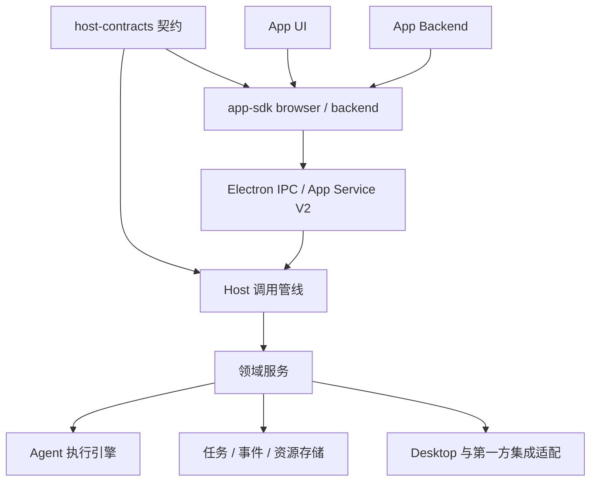

# Moss Host API 3 优化与 App 同步迁移方案

状态：设计方案，尚未实施。依据 2026-10-09 的 `moss` 与相邻 `moss-apps` 工作区；工作区包含未提交的开发内容。

本方案以长期 API 边界为目标，允许修改全部 App，不保留旧 API 兼容层。允许 API 破坏性升级不等于允许丢弃用户数据：安装身份、配置、凭据、业务记录和投递确认需要迁移。

## 1. 目标与关键决策

1. 发布 Host API / SDK / Runtime 3.0。Manifest 升为 V3，App Service 传输升为 V2；三个版本分别描述能力集合、包格式、传输格式，今后独立演进。
2. 用一个契约来源生成运行时校验、TypeScript 类型、客户端、权限目录和参考文档。公共方法必须定义输入、输出、错误、可调用场景和限制。
3. UI 与 Backend 使用同一套有类型的能力 API，经同一个 Host 调用管线执行；各自的传输适配器只处理 IPC。
4. App 客户端在初始化时绑定身份。公共 API 不再要求传入 `instanceId`，不提供跨 App 的实例管理；进程 generation、launch token 属于内部传输。
5. 外部消息会话与后台 Agent 执行保留不同的领域 API，共享资源授权、执行引擎、任务记录和事件基础设施。
6. 本地文件、云传输输入、截图、大 JSON 结果使用统一的资源引用。通知、会话导航、外观和输入框准备属于通用 Desktop 能力。
7. 通用协议与第一方集成协议分别声明开放范围。OpenIM 身份交换保留为受限集成，不引入任意远端请求或管理员接口代理。
8. 长操作返回可查询的任务，状态变更持久化；App 可订阅和补读。Core 不接收 Workflow 图、审计规则或知识库业务模型。

完成标准：独立 App 只依赖公开 SDK 与自己声明的契约，就能实现现有功能；不导入 Core 内部模块、不解析内部数据库、不重复编写取消与大结果传输。

## 2. 分层与代码组织



建议模块：

| 模块 | 责任 |
| --- | --- |
| `packages/host-contracts`，新增 | JSON Schema、协议目录、权限与范围、错误模型、事件、数据导出格式；生成器与契约差异检查 |
| `packages/app-sdk` | `browser`、`backend`、`testing` 独立入口；每个子路径的类型导出与运行时导出一致 |
| `packages/app-runtime` | 安装、进程、可信调用上下文、请求管线、租约、权限撤销、事件与资源访问控制 |
| `packages/host-services`，新增 | 可注入适配器的 Task、Execution、Channel、Observability 等领域服务；不导入 Electron |
| `ui/src/host`，新增 | 文件选择、原生媒体、通知和会话导航等 Desktop 适配器；统一装配入口 |
| `ui/src/host/integrations/openim`，新增 | 受限的 OpenIM 会话交换与管理适配；方法、发行者/安装授权策略集中声明 |

`ui/src/main.mjs` 只负责创建并装配服务。Host 各处针对 `moss.workflow`、`moss.audit`、`moss.trace` 的分支迁为显式能力、贡献声明或集成策略。

复用现有进程所有权、孤儿回收、凭据加密、日志脱敏和安装校验；升级其协议接入，不重写已经有效的机制。

## 3. 目标协议目录

以下为拟定的 V3 契约名称，不代表已存在。协议内使用 `get/list/create` 等方法名；一个协议管理多个资源时使用 `bindings.get` 等资源前缀。

| 目标协议 | SDK 入口 / 主要方法 | 替代或整合 |
| --- | --- | --- |
| `moss.host/v1` | `host.describe()`、`capabilities.list()`、`context.get()` | 公共能力发现、环境与限制；替代散落的能力判断 |
| `moss.identity/v1` | `identity.current()`、`directory.list/search()` | `moss.account/v1` |
| `moss.channels/v1` | `channels.catalog`、`bindings`、`sessions`、`turns`、`delivery.ack`、`context.observe` | `moss.agent/v1`，明确其外部消息会话职责 |
| `moss.tasks/v2` | `tasks.create/get/list/update/finish/cancel/resume`，可选 `pause` | `moss.tasks/v1`；提供后台任务与 Host 传输任务的统一查询/控制模型 |
| `moss.executions/v1` | `executions.start/get/list/cancel/events` | `moss.agent-execution/v1`；SDK 增加 `wait/subscribe` 辅助方法 |
| `moss.files/v1` | `files.pick/pickDestination/import/publish/materialize/read/release/resolve` | Platform 文件、Local Files、云上传本地选择、大结果分块、App 资源解析 |
| `moss.desktop/v1` | `desktop.notifications`、`navigation`、`links`、`screen`、`media`、`composer`、`appearance` | Platform 非文件能力、Audit 通知/导航、公共 UI 桥的宿主交互 |
| `moss.runtimes/v2` | `runtimes.list/get({ kind })` | `moss.runtimes/v1` 的 `python.get`；只报告受管运行时 |
| `moss.cloud-storage/v2` | `cloudStorage.status/quota/files/folders/shares/uploads/downloads` | 云端文件 API；上传/下载返回标准传输任务，控制转到 Tasks |
| `moss.mcp/v2` | `mcp.servers.list/save/remove/setEnabled/inspect`、`auth.start/clear` | MCP 配置、连接检查和授权；长授权过程返回任务 |
| `moss.observability/v1` | `observability.sources/feeds/snapshots/captureStatus` | Audit、Trace 的采集与源数据契约 |
| `moss.openim/v2`，受限集成 | `openim.session.issue`、`directory.list`、`conversations.prepareDirect/prepareGroup` | `moss.openim/v1`，从通用协议目录区分出来 |

App 自身信息、配置、凭据设置、私有 KV 和业务 Action 通过 SDK 的 `app` / `actions` 访问；它们同样由契约包定义，属于绑定当前 App 的 Runtime 服务，不形成通用 App 管理接口。

MCP 工具的发现与执行继续由 Core 的工具系统管理。App 管理服务配置并展示状态；既有工具加载策略应作为独立行为回归。

## 4. 公共调用契约

### 4.1 一个契约来源

每个方法至少声明：协议版本、输入 schema、输出 schema、错误集合、权限及资源范围、允许的 surface、是否幂等、最大载荷、超时策略、是否返回任务。每个事件声明数据 schema、投递类型和历史保留策略。

生成内容包括：

- 有类型的 Browser/Backend 客户端与方法映射，禁止用调用方手写 `request<Output>` 冒充结果推导。
- Host 输入/输出校验器；输入和公开 DTO 严格控制字段，业务校验在服务层。
- Manifest 能力依赖校验、安装授权说明、方法参考文档和契约测试夹具。
- 协议差异报告；方法删除、参数收窄、错误语义变化必须显式升级协议主版本。

SDK 自身及最小消费项目以 `skipLibCheck: false` 检查；Browser 入口不能依赖 Node 内置模块。

### 4.2 UI 与 Backend 的统一入口

拟定调用形式：

```ts
// Browser SDK 自动绑定当前 App，signal 由 SDK 映射为取消消息，不跨 IPC 传对象。
const result = await app.actions.invoke('request.send', input, { signal })
const selected = await host.files.pick({ kind: 'file', multiple: true }, { signal })

// Backend Action 上下文由 Host 绑定可信来源。
const task = await ctx.host.tasks.create({
  idempotencyKey: submissionId,
  title: '整理资料',
  limits: { maxConcurrency: 4, maxCalls: 32 },
})
const execution = await ctx.host.executions.start({
  scope: task.executionScope,
  idempotencyKey: 'collect:1',
  contextKey: 'collector',
  prompt: '整理输入并返回摘要',
  outputSchema: summarySchema,
  resources: { tools: ['Read', 'Glob', 'Grep'] },
})
const completed = await ctx.host.executions.wait(execution.ref, { signal })
const summary = await ctx.host.files.readJson(completed.resultRef, {
  maxBytes: 4 * 1024 * 1024,
})
```

UI 调用和 Backend Action 调用使用同样的管线：

`绑定当前 App/owner/来源 → 校验请求 → 检查授权与配额 → 执行 → 校验/脱敏结果 → 返回`。

来源、工作区与用户权限由 Host 取得。App 输入里的 `appId`、`owner`、`sessionId` 不能指定调用权限。依赖 foreground 来源的方法在后台初始化和定时器中返回 `CONTEXT_REQUIRED`；后台后续执行使用已建立的 Task scope。新增自动化来源须单独设计授权，本轮不默认授予后台任意创建会话的能力。

### 4.3 统一身份、配置和状态

- 每个安装所有者下仍由 Host 管理一个 App Backend；隐藏默认实例 ID，不修改现有数据归属。
- `app.runtime.get/subscribe` 返回固定枚举，分开描述本地进程状态与业务连接状态。
- `app.config.get/update` 受配置 schema 校验；UI 的凭据接口只有设置、清除、配置状态，Backend 读取自己获准的凭据。
- 启用、停用、授权和卸载属于 Moss 管理界面；App 可请求打开自己的管理页，不直接提升或恢复自身权限。
- `host.describe()` 返回实际协议版本、方法、支持的 surface 与限制；能力状态区分不支持、未授权、未配置、暂不可用。声明依赖不等于获得授权。

### 4.4 错误、重试与取消

公开错误采用 `{ code, message, details?, retryable, retryAfterMs? }`，`details` 按错误 schema 校验和脱敏。

基础错误包括 `INVALID_ARGUMENT`、`PERMISSION_DENIED`、`NOT_FOUND`、`CONFLICT`、`UNSUPPORTED`、`CONTEXT_REQUIRED`、`RESOURCE_EXHAUSTED`、`TIMEOUT`、`CANCELLED`、`UNAVAILABLE`、`RESULT_EXPIRED`、`CURSOR_EXPIRED`。

- revision 与幂等冲突必须返回 `CONFLICT`，附安全的冲突类型/当前 revision；不能统一归为 Host 不可用。
- `requestId` 表示一次传输尝试，`idempotencyKey` 表示一次业务提交；取消同样绑定调用身份。
- 从调用接收时建立取消登记，覆盖 Backend 尚未启动的窗口；App 不再每 250 ms 重发取消。
- 短调用的取消返回需说明操作是否停止。长期操作使用 `cancelling` 中间状态，底层结束后进入 `cancelled`；不可撤回的副作用仍保留实际完成记录。
- 停止 SDK `wait` 只取消等待。终止工作必须调用 `tasks.cancel` 或 `executions.cancel`。
- 网络和文件 handler 接收 AbortSignal；下载流式限额、使用临时文件，在提交前检查取消与授权 epoch。
- 拒绝/重试不自动重放结果未知的非幂等操作；提供任务查询来消除歧义。

## 5. 任务、执行、事件和存储

### 5.1 Task 与 Execution

Task 表示可展示、可恢复的后台工作；Execution 表示其中一次 Agent 执行。文件传输和授权过程也是 Host 管理的 Task，但其允许的控制动作由任务类型决定。

共同字段：稳定 ID、kind、status、revision、attempt、时间、进度摘要、resultRef、可执行控制动作。状态采用 `queued/running/paused/cancelling/completed/failed/cancelled/interrupted`；每个 kind 定义合法子集及转换。

- App 创建的工作任务允许 App 更新进度和提交完成；Host 创建的传输任务只允许调用方查询或执行获准控制，App 不能自行标记上传成功。
- `tasks.pause/resume` 仅对支持恢复的任务开放；上传、下载、OAuth、Agent 不共享未经验证的恢复语义。
- 读/控制任务仍检查任务所属 App、owner 及原始资源权限，不能通过 Tasks 绕过云端写入、删除或身份授权。
- 同一 contextKey 串行复用 Agent 上下文；不同 key 受 App、任务和全局并发上限约束。
- 资源列表只能收窄授权；Core 在执行时重算权限上限，统一禁止通过嵌套执行绕过工具策略。
- `update/finish/resume` 使用 revision。Task ID 保持稳定；resume 增加 attempt 并更换 executionScope，旧 scope 不再接受新执行。
- 完成执行保留幂等回执。结果未知的执行标记 interrupted，由 App 呈现恢复入口，不自动重放业务流程。

### 5.2 事件契约

事件形状：`{ eventId, streamId, sequence, timestamp, resourceRef?, revision?, data }`。

- Task/Execution 状态与终态事件在同一事务内写入，提交后推送。
- SDK 提供订阅、游标补读、断线退避和取消订阅；主 UI 与 Backend 使用相同事件语义。
- 状态/结果事件支持至少一次投递，调用方按 eventId 去重。高频进度和外观事件允许合并，重连后读取当前快照。
- `CURSOR_EXPIRED` 明确返回可恢复位置，SDK/调用方重新取快照；不静默丢失状态。
- Channel 的“处理了 Host 事件”与“已向外部平台发送消息”分别确认。外部投递保留稳定 delivery ID、回执和重试状态，不能因重连再次发送已确认消息。
- 任一订阅都再次检查声明、grant、owner 和资源范围，撤权后失效。
- Backend idle 生命周期统计活动租约。Host 执行中的后台任务与持久订阅不能被普通 Action 空闲计时意外杀死；必要时保活或在可交付事件时唤醒。App 停用、崩溃和 Moss 退出按各任务类型的中断规则处理。

### 5.3 持久化与限额

Core Task/Execution/回执/事件元数据使用 SQLite 事务；大结果保存为文件。数据库访问通过异步队列或 worker，主进程不随每次进度同步重写全部任务。

- 进度合并写入，终态立即提交；领域服务间共享存储契约，不通过手写 JSON 快照互相读取。
- 所有列表使用稳定排序的 cursor，同时限制条数和最终 JSON 字节数；可变集合明确快照一致性。
- 初始传输 envelope 上限保留 1 MiB；大 JSON 以 256 KiB 为建议内联阈值，分块大小按完整 envelope 的 UTF-8 字节数校验。
- 文件块以字节 offset 定义，避免 JS 字符索引与 UTF-8 混淆。结果读取按范围读取，不重复载入完整文件。
- 按 App 设置并发、内存/结果缓存、磁盘、历史事件保留量和期限；`host.describe` 报告生效限制。
- 清理策略保护仍被引用的结果和幂等回执。超过业务幂等保留期后的行为显式记录，不能宣称永久恰好一次。

## 6. 文件、数据源与业务边界

### 6.1 统一资源引用

公开引用采用 `{ ref, kind, name?, mediaType?, size?, revision?, expiresAt? }`。`ref` 是不透明标识，访问仍要求当前 App/owner 与授权，不是持有即可跨 App 访问的凭证。

- `files.pick` 返回用户选择的 file/directory 引用；`files.import` 创建 App 私有副本；选择原文件与复制导入分别表达。
- `files.pickDestination` 取得用户确认的写入目标；导出、云下载使用该目标，不传任意宿主路径。
- `files.publish` 允许 Backend 把自己数据目录内的文件注册成引用，使用相对路径并校验 realpath；引用可用作 Resource Provider 的返回值。
- `files.materialize` 只在获准的 Backend surface 返回本地租约和路径，支持 Python、OpenIM 原生 SDK 等本地依赖。UI 使用受控媒体 URL，不取得任意路径访问。
- 截图、云上传源、Task 结果、Audit/Trace 导出和 App Action 大结果复用这套引用及分块传输。
- `files.readJson` 是有最大字节限制的 SDK 辅助方法。默认不把任意大结果自动拼入内存。
- 目录导入提供有界遍历。需要持续刷新的目录来源显式申请持久引用，并支持失效与撤销，不能把临时选择引用当永久授权。
- 生命周期分为临时租约、任务结果、持久导入来源；公开到期信息并提供释放操作。App 自身业务资源 URI 继续由 App 解释，Core 只负责 provider 查找和授权。

这是一套 Host API 访问边界；现有 Node Backend 仍是受信任进程，本方案不声称增加了操作系统沙箱。

### 6.2 Observability

Core 拥有采集、脱敏、稳定事件格式和有界导出；App 拥有检索、索引、审计规则、发现项和可视化。

- 源类型明确为 `sessions`、`audit-events`、`model-traces`，分别授权；避免一个 read grant 自动读取全部敏感源。
- 输出为显式版本化的 SessionSnapshot、AuditEvent、TraceRecord DTO；不直接导出内部 session 对象、mossHome 或数据库布局。
- 快照返回 ResourceRef，增量 feed 返回游标和有界批次；App 不依赖 `source/snapshot.json`、`events/*.json` 等隐含路径协议。
- 采集消费者由 Manifest 贡献声明与安装授权建立，启用 App 即建立获准采集，停用即终止；不因 Trace 的 on-demand Backend 暂停而丢采集。
- Host 管理每个消费者的源数据队列/导出空间与保留策略。删除该消费者的采集数据需要独立权限，不删除原会话或其他消费者的数据。
- 重建 App 索引不会修改 Core 会话。Audit 的规则、处理状态及通知去重回执属于 App 持久业务数据。
- UI 通知和导航统一走 Desktop；通知来源由 Host 绑定 App，支持业务幂等键和持久待发送记录。

## 7. 需要重新适配的 App

已核对 `moss-apps/apps` 的 10 份 Manifest 及主要 UI/Backend 调用。8 个使用领域 Host 协议，2 个只使用公共 Runtime SDK。由于公共 SDK 和 Manifest 升级，10 个均需发布新版本并声明 `hostApi: ^3.0.0`；新 App 版本号按各自发布线递增，不要求与 Host 版本一致。

| App / 当前版本 | 现有依赖 | V3 修改范围 | 改动量 | 重点验收 |
| --- | --- | --- | --- | --- |
| `moss.devtools` 0.1.1 | UI Action、状态、外观；无领域协议 | 新 Browser/Backend SDK、绑定当前 App 的 Action、固定 Runtime 状态与 Desktop 外观；更新 Manifest/夹具 | 小 | 冷启动 Action、浏览器本地预览、现有计算结果 |
| `moss.http-client` 0.1.1 | Action、手写重复取消、私有 KV、状态/外观 | 新 SDK signal 取消，删除 250 ms 取消循环；错误码替代错误字符串判断，保留请求模板 | 小至中 | 启动前取消、请求中取消、超时、模板持久化与流量确实停止 |
| `moss.library` 0.1.3 | local-files、runtimes、Resource Provider、AI 工具 | FileRef/目录持久引用、导入/导出、Backend 本地路径租约、runtimes.get；provider 返回引用 | 中至大 | 大目录/Python 解析、刷新来源、取消导入、附件与工具引用、旧文档可读 |
| `moss.drive` 0.3.0 | cloud-storage、Backend 事件转发、自定义结果包装 | cloud-storage/v2、统一文件选择、Host 传输 Task、游标事件、标准错误；SDK 可直接提供通用代理，删除无业务逻辑的包装 | 中至大 | 上传下载暂停/恢复/取消、断网/重启、配额、分享创建/撤销、中文大文件 |
| `moss.mcp` 0.1.3 | mcp/v1、UI Action/取消、配置凭据 | mcp/v2 typed client、授权任务、公共状态/取消；更新最近的工具配置展示接线 | 中 | 配置和密钥保留、授权中止、连接检查、工具命名/发现/启停策略 |
| `moss.workflow` 0.1.9 | tasks、agent-execution、手写轮询/结果分块、composer、AI 工具/provider | 新 Task/Execution DTO、scope/attempt、事件订阅与 wait、ResourceRef；统一 composer/provider；替换轮询与自建分块通道 | 大 | 并发与上下文串行、结构化结果、停止、重启恢复、完成回执复用、会话追问、资源权限收窄 |
| `moss.feishu` 0.4.7 | agent/v1、手写 AgentBridge、UI 直调、配置凭据 | channels/v1、typed bridge、标准事件/投递回执、UI 授权范围与状态；移除 SDK 私有方法调用 | 大 | 配对、Binding/人工审核、会话轮换、离线启动/重连、去重和不重复投递 |
| `moss.openim` 0.2.8 | agent、platform、openim；UI 直调和原生 SDK | channels、files、desktop、openim/v2 全面适配；文件引用在 Backend materialize，再交原生 SDK；替换手写 UI 类型 | 大 | 登录续期、通讯录、群聊、自动回复/审核、截图/媒体/文件、下载取消、权限撤销 |
| `moss.audit` 0.1.1 | audit/v1、固定快照/事件路径、私有分块传输 | observability snapshots/feed、Desktop 通知/导航、统一大结果；源数据 DTO 适配现有审计服务 | 大 | 增量导入、审计规则/发现项状态保留、通知幂等、定位工具、脱敏、撤权时停止导出 |
| `moss.trace` 0.1.0 | trace/v1、固定 JSONL/会话目录、自建结果传输 | observability 采集声明/feed/资源、统一大结果、源数据删除和重建索引接口 | 大 | Backend 未启动时仍采集、索引重建、查看大提示词/响应、数据清理、停用停止采集 |

“改动量”是按接入层和数据契约的相对评估，不是工期承诺。App 的算法、业务 UI、规则和工作流图引擎无需随 Host 接口重写。

### 7.1 主要修改入口

路径相对于 `moss-apps`：

| App | 主要源文件 |
| --- | --- |
| devtools | `apps/devtools/src/lib/host.ts`、`src/backend/main.ts`、`src/lib/appearance.ts` |
| http-client | `apps/http-client/src/lib/host.ts`、`src/backend/main.ts`、`src/lib/appearance.ts` |
| library | `apps/library/src/backend/main.mjs`、`store.mjs`、`resource-uri.mjs`、`src/lib/api.ts` |
| drive | `apps/drive/src/backend/backend.ts`、`src/contracts.ts`、`src/lib/api.ts`、`store.ts` |
| mcp | `apps/mcp/src/backend/backend.ts`、`src/lib/api.ts`、配置契约和工具展示组件 |
| workflow | `apps/workflow/src/backend/runs.ts`、`main.ts`、`resources.ts`、`src/main.tsx` |
| feishu | `apps/feishu/src/backend/common/app-agent-bridge.ts`、飞书调用方、`src/index.html` |
| openim | `apps/openim/src/backend/openim-client.ts`、`automation.ts`、`src/lib/host.ts`、`globals.d.ts`、`components/openim-agent-policy.tsx`、`openim-view.tsx` |
| audit | `apps/audit/src/backend/backend.ts`、`transport.ts`、源数据适配与 `src/lib/api.ts` |
| trace | `apps/trace/src/backend/backend.ts`、`store.ts`、`trace/localIndex`、`src/lib/trace/api.ts` |

所有 App 还需修改各自 `app.moss.json`、SDK 依赖/锁文件、测试夹具、README、CHANGELOG 和包验证脚本。

Core 的 `examples/cloud-storage-app` 是另一个需要同步更新的示例，不计入上述 10 个业务 App。

## 8. 两个仓库的同步修改方案

### 阶段 A：冻结契约和验收样例

- 在 Core 创建契约包，完成协议目录、Manifest V3、App Service V2、权限/范围、Task/Ref/Event/Error DTO。
- 为 SDK 提供最小 Browser 与 Backend 样例，覆盖 Action、文件选择、大结果、后台 Agent 和 Channel 消息。
- 建立“旧接口 → 新接口 → 数据迁移 → App 调用入口”的机器可检查清单；契约变更需同步更新消费样例。
- Gate：生成类型、schema、exports、文档一致；严格 TS 消费项目通过。此阶段就能 review API，无需等待全部 App 改完。

### 阶段 B：落地公共 Runtime，先接两个小 App

- Core 实现统一调用/取消/错误/身份/状态、配置与 KV、Desktop 外观；保留原有进程管理机制。
- 同步修改 devtools、http-client，以真实 ZIP 验证 UI → Host → 启动 Backend → Action 的完整链路。
- Gate：冷启动前取消有效；浏览器 SDK 无 Node 依赖；未授权调用、重复 ID、超载和超时响应一致。

### 阶段 C：文件、传输与本地服务

- Core 实现 Files/ResourceRef、持久 Task、事件存储、Runtimes、Cloud Storage、MCP 与 Desktop 文件交互。
- 同步修改 library、drive、mcp。先用这三者固定导入、持续来源、大文件、传输恢复及授权任务行为。
- Gate：文件范围、租约撤销、下载取消后无额外写入、内存/载荷上限、上传恢复和原生路径消费者均验证。

### 阶段 D：Agent 执行与外部会话

- Core 接入 Executions 与 Channels；统一资源策略、完成回执和事件交付。
- 同步修改 workflow、feishu、openim；先完成 Workflow 的 Task/Execution，再接外部消息交付。
- Gate：Agent 恢复不会重复已完成调用；外部消息不会重复已确认投递；App/owner/会话边界及审核策略一致。

### 阶段 E：观测数据源

- Core 实现 Observability 的稳定 DTO、采集消费者、快照/增量流及源数据清理。
- 同步修改 audit、trace，删除对 Core 文件布局的依赖与自建大结果传输。
- Gate：索引可重建；审计业务状态可迁移；采集与 Backend 生命周期解耦；脱敏/撤权/停用覆盖在途任务。

### 阶段 F：完整切换与清理

- 删除旧 Host 注册、旧公共 SDK/类型、旧 UI bridge 方法、散落的 App ID 分支和废弃文档。
- 更新 Core 示例、构建资源/市场目录，以及 App 仓库的验证、打包、CI、发布与 catalog 脚本。
- 用最终 Core 构建和全部 10 个最终 App ZIP 联调；不能只验证 SDK mock 或 App 源码。
- Gate：扫描无生产代码旧协议依赖，全部契约/类型/集成验证通过，形成可回滚的发布清单。

阶段 B–E 在集成分支逐批联调；正式切换以阶段 F 的完整产物为准，不要求用户先安装一半的新 App。

### 8.1 依赖、提交与发布同步

现有 `moss-apps` 通过 `vendor/moss-core` 子模块与 workspace 引用 SDK。第一轮保留这一来源，但固定真实 Core 提交；不继续依赖某个 App 自己复制 SDK 或制造未纳入统一清单的快照。

- 每批 Core 提交生成不可变的 SDK/Runtime/契约构建与摘要；App 仓库锁定对应 Core SHA。
- 提供统一集成验证入口，支持指定一个准确的 Core 检出；禁止测试用了新 Core、打包却使用旧 vendor SDK。
- 最终 release manifest 记录 Core SHA、Host/SDK/Runtime/Service/Manifest 版本、契约摘要、10 个 App 版本和 ZIP 摘要。
- CI 验证 Core 的实际能力满足各 App 的 required/optional 能力声明，不能仅以 App 自称的最低版本作为测试 Host。
- 市场按 Host 版本选择 App 包。Core 3 不启动仅支持 Host 2 的 Backend；旧 Core 不安装要求 Host 3 的 App。
- 先准备全部兼容包及目录，再启用 Core 3 发布入口。已安装 App 在切换前验证匹配包与权限迁移，避免先升级 Core 再发现必要 App 无可用版本。
- 无需保留 V2/V3 双实现。旧版安装器、旧 App 包和迁移前数据快照作为回滚产物保留。

### 8.2 数据与授权迁移

| 数据 | 同步迁移规则 |
| --- | --- |
| App ID、owner、配置、凭据、私有 KV | 保持归属和稳定存储键；隐藏 instanceId 不代表搬空实例数据；HTTP 模板与 App 设置原样保留 |
| 安装 grant | 用显式映射表迁移等价权限；无法证明等价的拆分/扩大权限不自动授予，由升级安装界面展示授权差异 |
| Channel Binding/Session/Turn | 保留外部身份键、绑定 revision、会话映射、人工审核和投递 ACK；升级前后消息去重连续 |
| Task/Execution/结果 | 将 tasks.json 导入新存储，保持 ID、幂等键、完成结果与回执；未完成执行标为 interrupted，恢复时更换 scope |
| 云传输 | 保留云端文件 ID、分享及 transfer 的可恢复元数据；与服务端确认 offset/status 后恢复，未知完成状态先查询 |
| Library | 保留文档/集合/导入来源/业务 URI；为旧受信任来源建立可追溯引用，缺失或无法重新授权的目录标记需重新选择 |
| Audit | 保留规则、发现项处理状态和通知回执；源数据与索引按新 DTO 重新导入 |
| Trace | 保留采集历史；将旧源数据导入消费者数据空间，索引可重建；不把删除索引当删除用户采集记录 |

迁移在关闭旧 Backend 和冻结相关写入后执行，具备版本标记、可重复执行检查和失败恢复。回滚恢复相互匹配的 Core、App 包及受影响数据快照；外部已发生的发送、上传等副作用不能靠回滚撤销，因此相关回执不能丢弃或自动重放。

## 9. 验收矩阵与退出条件

必须验证以下三层：契约/服务测试、真实进程与 IPC 的集成测试、最终 ZIP 在目标 Desktop 环境的产品流程。

| 维度 | 退出条件 |
| --- | --- |
| 契约 | 所有方法/事件有 schema 与类型；所有 SDK exports 可被严格 TS 消费；生成文档与实际注册目录一致 |
| 身份/授权 | 两个 App、两个 owner、不同来源会话的交叉调用均拒绝；引用不能转交越权；UI 与 Backend 判定一致 |
| 生命周期 | 启动前/运行中/结束边界取消、进程崩溃、休眠、撤权、停用、升级、卸载、Host 退出覆盖 |
| 事件/幂等 | 断线补读、重复事件、游标过期、同键不同输入、结果已完成但响应丢失均有确定行为 |
| 资源 | 大文件/大 JSON 不突破预算；列表按字节有界；配额耗尽可恢复；临时文件与租约能清理 |
| 数据迁移 | 实际旧格式夹具升级成功；迁移中断后重跑；回滚验证；配置/凭据/确认回执/业务状态不丢失 |
| 产品流程 | 上表 10 个 App 的重点验收通过；Library/Workflow 工具和资源引用、MCP 工具加载行为单独回归 |
| 发布一致性 | 联调 Core SHA、SDK 契约摘要、App ZIP 摘要与最终发布清单一致 |

仅实现公共 SDK、仅修改协议名称、或仅通过现有单元测试，都不满足切换条件。完成上述 Gate 后再统一发布 Host API 3 和对应 App。
