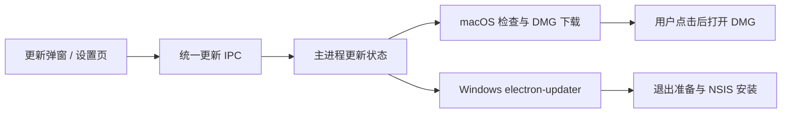

# Moss 版本升级方案

日期：2026-09-28。状态：设计稿，待实施及实机验证。

确定的平台策略：**macOS 检查新版、下载 DMG，完成后提示用户打开并手动安装；Windows NSIS 使用 electron-updater 完成下载、安装和重启。**参考 cc-haha 的更新状态、下载复用、安装准备和完整发布流程，复用 Moss 已有服务与界面。

## 1. 产品流程

### macOS

```text
后台检查 → 提示新版本 → 用户点击下载
→ 下载及校验 → 提示“下载完成” → 用户点击“打开安装包”
→ 系统打开 DMG → 用户退出 Moss、拖入应用程序并选择替换
→ 用户从应用程序目录重新打开 Moss
```

- 正式包在主窗口就绪约 5 秒后检查，之后每 6 小时检查一次；恢复联网或唤醒时按上次检查时间决定是否补查。后台失败不弹错误窗口，手动检查失败提供重试。
- 新版提示显示当前版本、目标版本、更新说明和包大小，主按钮为“下载新版”，辅助操作为“稍后”和“查看发布页”。
- 下载在后台继续，关闭弹窗不取消。显示进度、已下载大小和速度，支持取消及重试。
- 校验通过后显示“下载完成”，提供“打开安装包”和“在 Finder 中显示”。文案提示：“打开后，请先退出 Moss，再将 Moss 拖入应用程序并选择替换。”
- “打开安装包”由用户点击触发，仅请求系统打开已下载的 DMG。打开 DMG 不代表安装成功，也不自动退出 Moss、替换应用或重启。
- 用户安装前通过菜单或 `⌘Q` 完全退出 Moss。关闭窗口不等于退出；从“应用程序”目录打开安装后的 Moss。
- 下次启动以 `app.getVersion()` 显示实际版本。下载或打开 DMG 后不显示“升级成功”，也不因为用户尚未安装而判定更新失败。

macOS 的更新模块负责文件下载与打开；应用替换交给用户和 Finder 完成。因此不需要新增替换进程、原生启动器、安装锁交接或目录交换事务，Apple 发行签名也不是此流程的前置条件。

### Windows

```text
后台检查 → 后台下载及校验 → 提示“更新已就绪”
→ 用户点击“重启并安装” → 保存状态、结束必要运行时
→ electron-updater 调用 NSIS → 安装并重新启动
```

- Windows 安装版沿用 cc-haha 的后台下载体验；用户可以关闭自动下载，改为手动点击下载。
- 下载完成后提供“重启并安装”和“稍后”。任务运行时说明影响，提供“任务结束后安装”；明确选择停止任务后才执行停止操作。
- 设置 `autoInstallOnAppQuit=false`，由 Moss 统一控制安装时机。下载完成本身不表示同意立即中断工作。
- 安装准备或调用失败时保留已验证的更新包并允许重试；可以提供发布页中的手动安装入口。
- **Portable 继续下载同形态 Portable，由用户退出后替换。**不能因为系统是 Windows 就调用 NSIS 自动更新并改变安装形态。

### 范围

| 平台/安装形态 | 本期行为 |
| --- | --- |
| macOS arm64 DMG | 检查、下载、校验、提示打开；用户手动覆盖安装 |
| Windows x64 NSIS | 检查、下载、校验、一键安装重启 |
| Windows x64 Portable | 检查并下载 Portable，提示用户手动替换 |
| 其他平台/架构 | 没有兼容产物时明确说明，不推荐其他平台的包 |
| 开发态、未打包应用 | 显示开发版本，禁用真实安装型更新 |

未来若增加 macOS 发行签名，可另行启用标准 Electron 自动更新；当前实现不依赖该阶段。`MOSS_DISABLE_AUTO_UPDATE=true` 禁用后台检查；CI/开发态禁用真实更新副作用。

## 2. 代码依据与需要修复的问题

本方案参考本地 cc-haha（HEAD `0676c194`）和 Moss（HEAD `f5810dc0`）工作区代码。已阅读更新服务、状态回归测试、实际发布 workflow 和 Moss 打包校验；未验证线上发行包或真实安装。

| 现状或参考行为 | 本期处理 |
| --- | --- |
| Moss 已有 GitHub 查询、下载服务、更新弹窗，Mac 下载完成后已有“显示文件”按钮 | 补“打开安装包”、明确安装文案及错误处理，复用现有下载实现 |
| 资产选择仅评分，没有先过滤系统/架构 | 改为精确过滤后选择；已复现 Intel Mac、Windows x64 错误推荐 arm64 DMG |
| 弹窗连续查询自动和手动两条路径，均失败时仍可能显示最新版 | 按平台选择一条主查询路径；错误与无更新明确区分 |
| 弹窗打开会重置状态，主进程主要广播瞬时事件 | 主进程保存完整快照；重新打开弹窗恢复进度和已下载结果 |
| 同名非空文件被认为是有效缓存 | 缓存必须按版本、资产和摘要验证，残包不能直接打开 |
| `setAllowPrerelease()` 同时开启降级 | 完整 SemVer 比较；渠道变更后保持 `allowDowngrade=false` |
| Windows 当前只看平台，不区分 Portable/NSIS | 从安装形态决定自动更新能力 |
| Windows 直接 `quitAndInstall()`，同时退出钩子还有异步清理 | 统一安装准备，确保清理完成且安装器只启动一次 |
| cc-haha 有下载复用、按版本忽略、代理配置和重启超时恢复测试 | 复用这些行为契约；自动安装相关测试应用于 Windows |
| Moss 已有草稿发布和产物大小/SHA-512 校验 | 保留并扩展，不重新实现一套打包系统 |

cc-haha 的 macOS 正式发布流程已接入签名、公证及 Squirrel.Mac；Moss 本期 Mac 使用手动安装流程。既有“必须无发行签名”的打包校验可继续适用于当前发行模式。

## 3. 客户端结构



保留当前 `auto-updater-service.mjs` 作为 Windows 适配器，将手动下载代码从 `update-ipc.mjs` 提取为可测试服务。新增轻量 coordinator 负责状态、候选绑定和并发控制；渲染层只订阅快照及发出操作。

概念接口：

- `getState()`、`onStateChanged(snapshot)`：版本、能力、进度、错误及可执行操作。
- `check()`、`download({ candidateId })`、`cancelDownload()`、`dismiss({ version })`。
- `openDownloadedAsset({ downloadId })`、`showDownloadedAsset({ downloadId })`。
- `install({ candidateId, when: 'now' | 'idle' })`：仅 Windows NSIS 可调用。

能力返回 `mode: nativeUpdater | manual | unsupported | development`。Mac 为 `manual`，不初始化标准自动安装服务、不发送安装 IPC。

状态转换：

```text
共用：idle → checking → upToDate / available / unsupported / error
下载：available → downloading → verifying → downloaded
Mac：downloaded → 用户请求打开 DMG，仍保持 downloaded
Windows：downloaded → preparingInstall → installing → restarting
```

每个快照带递增 revision。订阅后拉取快照，丢弃过期事件；打开/关闭弹窗不重置后台任务。重复检查、下载和安装请求去重；已下载期间检查不能销毁可用缓存。

一次下载绑定 `tag + version + platform + arch + asset + checksum`，不因检查到更新版本而替换当前下载对象。“稍后”按版本抑制自动提醒，手动检查仍展示可用更新。

## 4. 安装包匹配、下载与打开

### 匹配和元数据

- 保留 GitHub Releases 作为当前分发源，以完整 SemVer 选择允许渠道内的新版本，忽略草稿、同版本和旧版本。
- 严格匹配平台、当前应用架构及包类型。macOS 推荐该版本的 DMG；NSIS 和 Portable 分别匹配明确命名的资产，未知架构不默认当 x64。
- Mac 复用同一 Release 的 `latest-mac.yml`，读取 DMG 的大小和 SHA-512，并核对 metadata 版本、资产名与 Release 一致。Windows NSIS 继续由 electron-updater 消费 `latest.yml`。
- Portable 的校验信息通过发布步骤生成的 `SHA512SUMS` 提供，内容绑定该版本的最终资产。缺少可核对的摘要时提供发布页，不把文件标为“已校验”。
- 更新说明按同一个 tag 补充；说明加载失败不改变已确定的下载候选。首次展示版本直接读取本机信息，不依赖网络请求成功。
- 未找到兼容包显示明确原因；元数据缺失、网络失败和“已是最新版本”分别处理。

### 下载和缓存

- 复用现有下载服务，以唯一 `.part` 文件下载；完整写入后核对大小和摘要，校验成功才改为最终文件名。
- 安装包保存到系统下载目录或由主进程管理的下载位置。同名用户文件不直接覆盖；只复用已重新验证的相同资产，否则生成唯一文件名。
- 已有缓存不能仅凭非空判断完整。取消/失败清理本次任务拥有的残片，不删除用户的其他文件。
- 检查超时建议 30 秒，下载采用无进度超时；网络错误有限重试。处理磁盘空间不足、写入失败和取消，校验失败不开放打开/安装按钮。
- 主进程接收 candidate/download ID，自己确定 URL 和文件路径；渲染层不能传任意 URL、任意路径用于下载或打开。
- 请求限定 HTTPS、既定仓库及发布资产域名，逐跳验证重定向。Mac 检查和下载使用一致的网络配置；Windows 更新代理配置到 updater 自己的 session。
- Windows 初期参考 cc-haha 使用全量下载，继续生成 blockmap 以兼容标准更新协议。

### “打开安装包”操作

1. 根据 download ID 找到校验通过的、属于该候选的 DMG；拒绝未知路径、非 DMG、符号链接、已删除或被替换的文件。
2. 打开前核实文件仍与记录的资产一致，必要时重新验证摘要，不能把“曾经下载过”视为一直可信。
3. 调用 Electron `shell.openPath()` 打开 DMG，并检查返回的错误字符串；失败保留“在 Finder 中显示”和重试入口。
4. 打开成功只表示系统接受了文件打开请求，不表示用户已经替换或运行新版。全程不挂载后自动复制、不执行安装脚本、不改应用目录。

HTTPS 和 SHA-512 分别提供传输保护与内容一致性校验；同源包和摘要同时被篡改仍是发行源信任风险。应保护发布账号和发布权限，保留不可变版本资产。独立更新清单签名可后续增强，不作为本次 Mac 下载/打开流程的额外依赖，也不能把手动安装描述为已消除发行源风险。

## 5. Windows 安装与数据保留

Windows 安装前在主进程重新确认已校验的 NSIS 候选，并串行化安装请求：

1. 确认活跃会话、工具、Agent Team、终端和 App 操作；等待任务结束或按用户选择停止。
2. 临近安装时暂停新任务入口、cron、邮件/IM 接收，刷新会话、草稿及任务状态，完成 App/团队退出。
3. 复用现有退出钩子，等待必要的异步操作完成；用安装意图区分 `app.quit()` 与 `quitAndInstall()`，确保不重复启动安装器。
4. 调用 NSIS 安装并重新启动。准备超时或安装调用失败时恢复可恢复的入口，保留下载包，展示具体错误和重试。
5. 若安装请求后约 15 秒应用仍未开始退出，恢复可重试状态；已经退出后的成功由下一次真实启动及版本确认，界面计时器不能证明安装成功。

macOS 下载和打开 DMG 不执行上述安装退出逻辑。用户手动退出沿用正常退出流程；安装提示要求先完全退出再替换应用。

两个平台均保留应用身份 `com.moss.ai`、数据目录和 profile 选择规则。配置、凭据、会话、JSONL、记忆、Skills、Agents、Apps 数据、cron 和附件不随程序安装删除。自定义 `MOSS_HOME` 用户沿用原启动入口；从 Finder 启动不天然继承终端临时环境，不能把打开其他 profile 误认为数据丢失。

数据迁移属于应用版本兼容责任，手动安装也不能省略：持久化格式变化时提供旧数据 fixture、幂等迁移、必要备份和中断恢复。SQLite 使用一致性备份，不能只复制仍在使用 WAL 的主文件。Moss 当前主模块顶层就打开数据库，涉及迁移/兼容检查时必须在业务写入前执行。

程序回退与数据回退分开。数据已不兼容旧版时不能只重新安装旧程序；保留旧版本下载地址及明确恢复说明，不承诺无条件自动回滚。本次仅调整更新流程时，应避免同时引入无关的破坏性数据迁移。

## 6. 版本与发布流程

根目录 `package.json.version` 为产品版本来源。根包、UI、内嵌 Agent 构建版本、tag 和 `release-notes/v<version>.md` 必须一致；当前源码版本为 `0.0.1`，首个目标版本需核对实际已分发版本后确定。

- `sync-ui-version.mjs` 增加只读校验模式，版本准备在提交前完成，CI 验证 tag 与源码一致。
- 发布说明至少包含用户变化、修复、兼容性和必要安装/迁移说明。
- 第一阶段开放 stable。预发布在 metadata 命名、上传、校验与客户端策略一起验证后启用；切换渠道不隐式允许降级。
- 保留现有 DMG、ZIP、NSIS、Portable 文件名及标准 YAML，以兼容旧客户端。Mac 旧客户端可继续下载新版 DMG 并手动安装，不需要特殊的启动器过渡版本。

```text
版本/tag/发布说明检查 → 现有质量门禁
→ 各平台构建与包校验 → 汇总最终资产和 metadata
→ 校验版本、大小、摘要、所需资产集合 → 上传 Release 草稿
→ 验证上传内容 → 公开 Release → 提升稳定镜像 latest
```

参考 cc-haha，各平台上传中间构建产物，最终 job 统一发布。增加同平台多架构时集中合并标准 metadata，避免覆盖。复用 `verify-package.mjs` 的版本、资源、大小和 SHA-512 校验，将固定“11 个文件”改为本次平台/渠道推导的必需集合。

公开 Release 的同名资产不替换，修复使用更高版本；重跑只清理草稿。Server/Runtime 的版本镜像先以不可变 tag/digest 发布，稳定 `latest` 在最终发布阶段提升；GitHub/GHCR 不是跨服务原子事务，部署以明确版本为准。

本期 Mac 无发行签名包仍可能出现系统打开提示。通过真实 DMG 安装路径验证并提供准确说明，不宣称下载功能可以消除 Gatekeeper/组织设备策略限制。未来启用平台签名时，再同步调整目前要求无发行签名的打包校验；Windows 外部签名后需重新计算摘要及 blockmap。

## 7. Server、CLI 边界

桌面更新只更新本机桌面及随包运行时。远端 Server、部署中的 Runtime、独立 Apps 使用自己的升级流程。

Server 后续改进保留 `deploy/server/upgrade.sh`：先固定目标版本、拉取验证镜像，再备份配置和必要数据、切换运行版本，检查 `/healthz`、`/readyz` 及最小会话链路；失败按数据兼容范围恢复。当前脚本先修改 `.env` 再启动，需避免拉取失败遗留错误配置。

Server 已有 `model_schema` 及 1/2/3 → 4 的升级逻辑，应在现有机制上增加版本恢复验证。涉及 schema 变化的发版须先完成相应迁移验收。桌面/Server 混合版本的支持范围通过协议能力和跨版本测试确定。

CLI 当前 bin 仍叫 `claude`，本期只同步产品构建版本。独立 CLI 自更新须先明确 Moss 的包名和分发契约，不直接复制上游安装路径。

## 8. 实施拆分

| 阶段 | 交付 |
| --- | --- |
| P0：发布基础 | 版本/说明校验、完整资产集合、摘要、最终发布顺序 |
| P1：桌面更新 | Mac 正确检查、下载、校验、打开 DMG；Windows NSIS 一键安装；统一状态、重试和 Portable 识别 |
| P2：增强 | beta、更新代理、可选平台/发行清单签名；按需求增加支持平台 |
| P3：部署兼容 | Server 升级恢复、数据迁移和跨版本连接验证 |

主要文件落点：

| 文件 | 变更 |
| --- | --- |
| `ui/src/update-capabilities.mjs` | 严格平台/架构/安装形态选择 |
| `ui/src/auto-updater-service.mjs` | Windows 事件、下载及安装适配 |
| `ui/src/update-coordinator.mjs`（新增） | 状态快照、候选绑定、并发与重试 |
| `ui/src/update-download-service.mjs`（新增） | 从 IPC 提取下载、摘要、缓存及打开前验证 |
| `ui/src/update-ipc.mjs`、`preload.mjs`、renderer 类型 | 查询、下载、打开 DMG 及 Windows 安装 API |
| `ui/src/renderer-react/components/update-modal.tsx`、设置页 | 平台对应按钮、快照展示、安装指引 |
| `ui/src/main.mjs`、必要的退出协调模块 | 启动检查、Windows 安装前的现有生命周期协调 |
| `ui/scripts/verify-package.mjs`、版本脚本、发布 workflow | 产物及版本契约、集中发布 |

## 9. 验收与剩余风险

本期优先验证实际保留的功能：

- 系统、架构及安装形态错误时不推荐包；同版本、旧版本、非法版本和预发布策略正确。
- 检查失败不误报最新版；重复点击、弹窗重开、渲染重载不重复下载或丢进度。
- 残包、同名旧文件、摘要不符、断网、取消、空间不足和非法重定向均有可恢复结果。
- Mac 只打开记录中已验证的 DMG；文件删除/改写、系统打开失败、任意路径 IPC 请求得到正确处理。
- Mac 下载完成显示“下载完成”，不显示安装成功；打开、关闭窗口和正常退出均不触发自行替换。
- Windows 下载复用、活动任务保护、退出准备失败、安装器启动一次、重启超时及手动兜底。
- 公开 Release 不被重跑覆盖；缺少产物或校验不一致阻止公开发布。
- 涉及持久化变化时使用临时 profile/数据库做迁移测试，不使用开发者真实数据。

实机路径分别验证：

1. **Mac：**旧版提示 → 下载 DMG → 点击打开 → 用户完全退出 → Finder 覆盖安装 → 从应用程序打开新版，检查版本和数据；验证无签名系统提示及打开失败兜底。
2. **Windows NSIS：**旧版检查 → 下载 → 一键安装重启 → 版本和数据确认；至少再验证一次安装准备失败后重试。
3. **Windows Portable：**获取同形态文件、退出后手动替换，不能被切换成 NSIS 安装版。

macOS 自行替换、启动竞争和替换事务相关风险已从本期实现范围移除；仍需承担正确下载、发行源保护、清晰安装指引及新旧版本数据兼容责任。正常下载安装仍可能受系统策略影响，不能承诺无签名包在所有设备都无提示。

### 本次实现记录（2026-09-28）

已实现桌面稳定渠道的第一版：

- 启动 5 秒后、每 6 小时及系统唤醒时检查；开发模式禁用。所有平台使用同一 Release 选择规则；NSIS 下载固定到已选版本的标准元数据，保持禁止降级。
- macOS 下载并校验 DMG，用户点击后打开或在 Finder 中显示。Windows NSIS 默认后台下载，用户点击“安装并重启”后走静默安装及自动重启（仍遵循系统的提权要求）；Portable 下载同形态 EXE 后手动替换。
- 主进程统一状态、递增 revision、候选/下载 ID、重复操作防护；关闭或重开弹窗保留状态。“稍后”和 Windows 自动下载偏好保存在 Electron userData 下的 `update-preferences.json`。
- 手动下载保存在系统下载目录的 `Moss Updates/<候选 ID>/`。重启后重新检查并请求下载时，会重新校验和复用缓存；不直接恢复上次进程的已下载状态。下载使用独立 `.part`、超时、大小及 SHA-512 校验。打开前重新校验，IPC 不接受任意下载 URL 或文件路径。
- Windows 安装前阻止活跃会话、后台任务、Agent Team、终端、App 操作和运行时安装。第一版要求用户先结束这些工作后再次点击安装；不提供自动等待空闲或强制中断按钮。开始退出准备后暂停新会话与 App 操作，复用普通退出的异步清理及会话持久化；超时或失败保留安装包和重试入口。部分服务已经停止时提示退出后重新打开，不假装恢复完整工作状态。
- Windows 构建新增 `SHA512SUMS`，包校验核对最终 NSIS/Portable 字节；发布流程必须包含该文件才能公开 Release。沿用现有草稿发布及公开资产不可覆盖保护。

本次不更改应用身份、数据目录、持久化格式或产品版本号。beta、独立清单签名、自动等待空闲、发布聚合重构、Server 镜像提升顺序和 Server/CLI 升级属于后续范围。

验证记录：桌面端完整测试 784 项通过；补充退出及下载超时测试后，更新/退出/终端定向测试 50 项通过。UI 语法与 TypeScript 检查、renderer 生产构建、发布 workflow YAML 解析通过。以上为自动化和构建验证；尚未执行真实 Windows NSIS 升级或 macOS DMG 覆盖安装，也未发布新版本。

## 10. 参考源码

Moss：[更新服务](../ui/src/auto-updater-service.mjs)、[能力与资产选择](../ui/src/update-capabilities.mjs)、[更新 IPC](../ui/src/update-ipc.mjs)、[更新弹窗](../ui/src/renderer-react/components/update-modal.tsx)、[主进程](../ui/src/main.mjs)、[profile 路径](../ui/src/moss-home.mjs)、[包校验](../ui/scripts/verify-package.mjs)、[版本同步](../scripts/sync-ui-version.mjs)、[发布流程](../.github/workflows/release.yml)、[Server 升级](../deploy/server/upgrade.sh)、[Server schema](../server/src/model/index.ts)。

cc-haha：[updater](../../cc-haha/desktop/electron/services/updater.ts)、[updateStore](../../cc-haha/desktop/src/stores/updateStore.ts)、[updater 测试](../../cc-haha/desktop/electron/services/updater.test.ts)、[状态测试](../../cc-haha/desktop/src/stores/updateStore.test.ts)、[发布 workflow](../../cc-haha/.github/workflows/release-desktop.yml)、[发布测试](../../cc-haha/scripts/pr/release-workflow.test.ts)、[metadata 合并](../../cc-haha/scripts/release-update-metadata.ts)、[签名后 metadata 刷新](../../cc-haha/scripts/refresh-windows-update-metadata.ts)。
