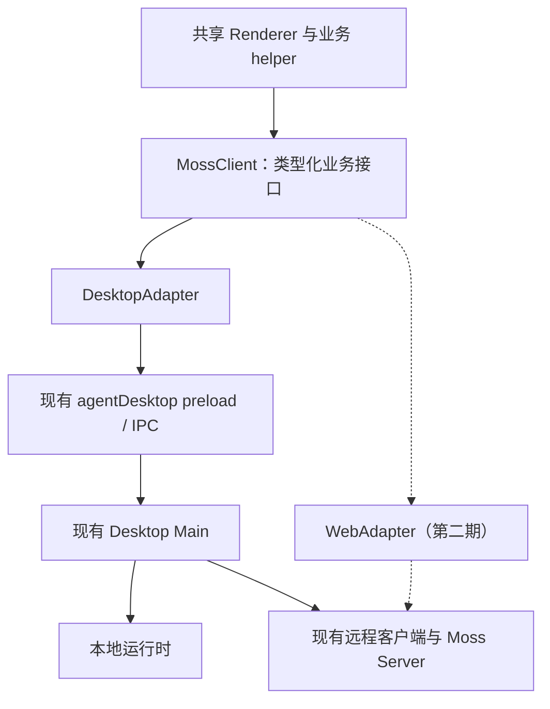

# 统一 Transport：以桌面稳定性为先的实施规划

日期：2026-10-08。状态：规划，尚未实施生产代码改造。

评估基线：HEAD `c0a5e0b91f60d273a1ea0d43051cf6a4bbe36af8` 加当前工作区已有改动。当前 App 审计迁移正在修改 Main、preload、App.tsx、types.d.ts 等文件；后续实施以合并后的实际内容重新核对调用清单，不覆盖这些改动。

## 1. 建议采用的方案

第一期完成 **Renderer → 类型明确的 MossClient → DesktopAdapter → 现有 preload / IPC**。Desktop Main 继续决定本地或远程执行，沿用现有 Session、Runner、权限处理、工作区和存储。

这是一次客户端接口收敛。稳定性的主要依据是保持实际执行路径不变，通过分模块替换调用入口，逐段证明行为等价。

- Renderer 使用按业务分组的接口，不再直接访问 `window.agentDesktop` 或拼接 IPC channel。
- DesktopAdapter 逐方法转发给现有 bridge；不维护会话状态、不接管任务队列、不增加自动重试。
- 先迁移会话与文件主链路，再迁移项目、资源、App 管理和桌面功能。
- 以每阶段独立提交、测试和回退作为交付单位。
- 第二期再实现 WebAdapter，单独完成浏览器认证、工作区文件访问和事件恢复验收。

第一期不会修改服务器通信协议、会话数据库结构、transcript 格式或 App Host API。也不会增加“断网继续执行”、跨机迁移、Nexus、k3s 或新的运行引擎。上述能力有各自的数据与生命周期要求，不能靠适配层获得。

**稳定性判断：第一期具备实现稳定迁移的条件，风险可控；目前的检查只能证明旧实现具备可用基线，不能提前证明尚未实施的改造稳定。发布以第 8 节验收结果为准。**

## 2. 实际改动面的盘点

使用 TypeScript AST 扫描 `ui/src/renderer-react` 下 158 个 TS/TSX/MJS 文件，得到：

| 项目 | 当前数量 | 含义 |
| --- | ---: | --- |
| 显式 `window.agentDesktop.*` 成员访问 | 266 | 包括调用、方法引用和对象引用 |
| 其中直接调用表达式 | 258 | 不含把方法或对象传给辅助函数后的间接调用 |
| 不同成员路径 | 191 | 其中 188 个路径出现直接调用 |
| 有显式成员访问的文件 | 42 | 具体分布见附录 |
| 整个宿主对象引用 | 2 处 | 输出文件卡片、Markdown 链接处理 |
| 连同上述引用涉及的文件 | 44 | 是当前 Renderer 迁移基数，不是全部修改文件数 |
| 原始 IPC 调用 | 24 | `ipcInvoke` 20 处，`ipcOn/ipcOff` 各 2 处 |
| preload 暴露的叶子函数 | 236 | 包括通过对象间接调用及主 Renderer 未直接调用的能力 |

数字是静态扫描结果，不是运行时请求次数，也不包含全部 helper 间接调用。`update`、`workspaceVersions` 等对象会传给其他函数，不能因为某个方法未直接出现就删除它。

主要集中位置：

| 文件 | 显式访问数 | 迁移关注点 |
| --- | ---: | --- |
| `renderer-react/App.tsx` | 76 | 启动、会话发送、事件订阅、审批、跨模块入口 |
| `components/browser-panel.tsx` | 27 | 原生浏览器、授权导航、连接器回调 |
| `components/chat-area.tsx` | 20 | 输入、资源选择、文件、任务 |
| `components/projects/project-workspace.tsx` | 16 | 项目、资产、任务和决策 |
| `components/apps-panel.tsx` | 10 | App 安装、权限、配置和生命周期 |
| `components/settings-view.tsx` | 9 | 配置、远程登录、运行环境 |

还有三类容易遗漏的依赖：

1. `Window['agentDesktop']` 类型引用，不能只替换运行时代码。
2. helper 的默认参数、对象别名及注入依赖，例如 `openAssistantOutputFile(..., host = window.agentDesktop)`。
3. 同一构建里的 PreviewWindow 和 TerminalWindow。Terminal 使用独立的 `window.mossTerminal`，不能强制依赖主窗口 bridge。

## 3. 架构与代码组织

### 3.1 数据流



第一期不会让 Desktop Renderer 直接连接 Server，也不会把 Main 中的编排搬到浏览器。否则模型配置、附件上传、权限请求、队列和历史维护会同时换执行位置，显著增加回归面。

### 3.2 建议目录

```text
ui/src/client/
  contracts/
    index.ts                   # MossClient 及能力接口
    sessions.ts                # 会话请求/结果；引用现有领域类型
    events.ts                  # 宿主事件外层类型，保留引擎消息载荷
    resources.ts               # 技能、专家、连接器与市场
    native.ts                  # 桌面能力与独立窗口能力
  desktop/
    bridge.ts                  # 现有 preload 的底层类型
    create-desktop-client.ts   # 静态方法映射、纯转发
    create-terminal-client.ts # 独立终端 bridge 的适配

ui/src/renderer-react/client/
  client-provider.tsx          # 注入稳定 client；组件从这里读取
  bootstrap.ts                # 唯一获取当前窗口原生 bridge 的位置

ui/tests/
  desktop-client-contract.test.ts
  client-subscriptions.test.ts
  client-session-flow.test.ts
  client-capabilities.test.ts

ui/scripts/
  check-client-boundary.mjs    # 检查全局宿主访问、原始 channel 和依赖边界
  test-client-session.mjs     # 真实 Electron 会话冒烟，隔离测试数据
```

文件拆分可随规模微调。第一期放在 UI package 内，不提前引入新的 workspace package。真正由 Web 或第二个 package 消费时，再把已稳定的纯契约提取为共享包。

### 3.3 接口按能力分组

| 分组 | 范围 | 第一期底层 |
| --- | --- | --- |
| `sessions` | 列表、创建、详情、发送、取消、标题、权限模式、历史事件 | 现有 agent IPC |
| `decisions` | 问题、计划、工具决策的已有请求与应答 | 现有 question / plan / decision IPC |
| `workspace` | 目录、文件读写、会话文件解析 | 现有 workspace / preview bridge |
| `projects` | 项目配置、资产、任务、记忆和项目决策 | 现有 project IPC |
| `resources` | 技能、专家、连接器、目录和市场 | 现有资源 IPC；显式封装原始 channel |
| `apps` | App 市场、安装、实例、权限、资源和运行管理 | 现有 App IPC；Host 授权逻辑保留 |
| `settings / usage / memory / notifications / automation` | 现有各类业务能力 | 对应现有 bridge |
| `native` | 系统文件选择、外链、原生浏览器、窗口、终端、更新等 | 现有桌面能力或独立终端 bridge |

新接口不能公开任意 `invoke(channel, payload)`。动态定时任务入口改成有限方法，例如 `automation.list({ source })`、`toggle`、`remove`；适配器内部把 source 映射到明确的已有 channel。

业务 helper 接收所需的窄接口，不接收整个 Window。例如 Markdown 链接处理只依赖打开外链和 App 资源；文件卡片只依赖文件解析、预览和系统打开。

### 3.4 类型与初始化规则

- 契约层不导入 Electron、Node 模块、Main、React 组件或凭据存储。
- 复用已有 `SessionSummary`、`SessionDetail` 等类型。需要搬移时，原 `types.d.ts` 暂时重导出，避免维护两份相同 DTO。
- DesktopBridge 只供适配器和初始化使用；共享契约不从 `Window['agentDesktop']` 反推。
- 补齐 send、目录读取和事件外层等关键 `any`。引擎事件内部载荷本期保持兼容，不附带进行全量 SDK 消息建模。
- 新契约增加类型正反例，验证错误参数与不存在的方法无法通过编译；不同时把整个 UI 项目切到 strict 模式，以免把无关类型整改混入本次迁移。
- 现有方法结果格式按方法保留，例如 `{ success, data }` 与 `{ ok }` 不能自动互换；为其命名和描述，不一口气改所有异常协议。
- client 在窗口启动时创建一次并注入；构造函数不发请求、不订阅事件、不创建运行时。
- React StrictMode 的 mount → cleanup → mount 不得产生额外任务或遗留监听器。provider 自身不因 effect 清理而永久销毁一个将被复用的 client。
- PreviewWindow 使用自己的初始化流程；TerminalWindow 只初始化终端 client，不读取不存在的 agentDesktop。
- App 独立 UI 继续使用 `apps/app-preload.mjs` 与自己的授权协议，不能向 App 页面暴露 MossClient。

## 4. 必须保留的行为

| 编号 | 当前契约及改造要求 | 对应风险 |
| --- | --- | --- |
| C1 | `send()` 沿用当前等待本轮处理完成后返回的语义 | 改成提交即返回，会提前释放 UI 状态、触发下一轮或遗漏错误 |
| C2 | 不给所有调用统一添加短超时；长会话与快速查询分别处理 | 正常长任务被客户端判断为失败 |
| C3 | transport 不重试发送、审批、文件写入、安装等副作用操作 | 原请求已执行但回包丢失时重复执行 |
| C4 | transport 不新增发送队列；保留 UI 与 Main 的既有排队行为 | 双重排队导致取消对象错误、顺序变化 |
| C5 | 保留 Desktop ID 与 underlying server/engine ID 的转换边界 | 会话串线、工作区错配、删除错误对象 |
| C6 | `abort()` 仍取消当前工作；与关闭订阅、终止会话、删除会话分开 | 关页面误杀会话或取消后数据丢失 |
| C7 | 远程断线沿用“中断当前轮、保留可恢复会话”，不自动重发 prompt | 误承诺后台持续执行、重复工具调用 |
| C8 | 事件外层 sessionId、requestId 及引擎载荷原样传递 | 工具结果、问题或审批落入其他会话 |
| C9 | 事件回调直接转发，不新增异步批次、节流或内容去重 | 顺序改变、文本丢片、同样内容的合法消息被丢弃 |
| C10 | 每次订阅有独立且可重复安全调用的 unsubscribe | StrictMode、多窗口、反复打开页面导致重复消息 |
| C11 | 保留 `replaceHistory`、删除标记、资源读取的旧响应失效机制 | 较短的新历史被旧缓存覆盖、删除后会话复活 |
| C12 | 附件仍由原有宿主流程本地化或上传，远程路径不直接传给本地 fs | 读错文件、文件暴露、预览损坏 |
| C13 | 保留取消文件选择、业务拒绝、权限不足与网络失败的区别 | 取消被显示为成功、拒绝被当成空结果 |
| C14 | 适配层不持有新增历史库、内存副本或凭据副本 | 同一事实出现多个写入方 |
| C15 | 不使用 `removeAllListeners` 清理共享 channel | 一个组件卸载导致其他组件失去订阅 |

事件有不同 channel，现有系统没有跨 channel 全局顺序保证。本期要求保留原有触发与转发关系，不凭适配层生成一个“全局可靠事件流”。

异步结果仍可能在页面切换后回来。已有业务层按 session、请求代际和删除状态丢弃旧结果的逻辑保留；退订不是取消已发出的服务请求。

## 5. 原始 IPC 的收敛方式

已发现的原始调用集中在：

| 位置 | 当前用途 | 迁移方式 |
| --- | --- | --- |
| App / connector-hub-view | `connector-hub:changed` 的 on/off | `resources.connectors.onChanged()` 返回 unsubscribe |
| chat-area | `skill-store:getInstalledSkills` | 具名技能列表方法 |
| cron-view | 动态拼接本地/云端定时任务 channel | source 枚举 + list/toggle/remove 三个具名方法 |
| expert-hub-view | 专家目录、分类、详情、安装、卸载 | 专家市场具名方法 |
| skill-hub-view | 技能目录、分类、安装、卸载、导入 | 技能市场具名方法；文件选择划入 native |
| project-resource-picker | 技能/专家查询 | 使用上述目录查询接口 |
| project-resource-sync | helper 内部连续查询与安装 | 注入窄资源接口，保留既有安装顺序与错误处理 |

优先给 preload 增加显式方法，转发到已有 Main handler。过渡中静态 channel 映射也只能留在 DesktopAdapter 内；禁止把 Renderer 传来的任意字符串转发出去。

本期主 Renderer 完成迁移后，底层旧 bridge 仍可为适配器和其他已知消费者保留。删除底层通用接口需另查全部消费者，不与迁移同时做未经验证的清理。

## 6. 分阶段实施与退出条件

### S0：固定基线与逐方法清单

工作：

1. 在包含当前 App 迁移的工作区上重新生成调用、别名、事件和原始 channel 清单。
2. 为方法登记输入、输出、错误、完成时机、是否有副作用、支持的窗口和运行模式。
3. 固定普通本地会话、远程会话、项目会话、文件与 App 导航的基线场景。
4. 为发送、取消、问题、历史替换和删除竞争补足改造前的行为证据。

退出条件：清单覆盖 44 个已识别 Renderer 文件及 helper 间接调用；已知失败与测试能力缺口显式记录。当前已执行的 68 项检查见第 10 节。

### S1：新增契约与 DesktopAdapter

工作：

1. 添加契约、纯转发适配器、注入入口。
2. 给每个已迁移方法建立实际参数、返回值、异常和调用次数断言。
3. 补事件订阅和 StrictMode 生命周期检查。
4. 新增边界检查脚本，先允许现有存量调用，禁止新增越界点。

退出条件：client 初始化没有副作用；方法一次调用只触发一次底层调用；转发不改变结果和事件；适配器可在无 Electron 的测试进程中通过注入 fake bridge 测试。

### S2：迁移会话、决策和工作区主链路

工作：

1. 迁移 App.tsx 的会话读写、发送、取消、问题、计划和会话事件。
2. 迁移 chat-area、搜索、会话详情和文件操作所需调用。
3. 保留现有 Main 发送队列、资源准备、历史合并与远程客户端。
4. 把受影响的源码字符串断言逐步替换为行为测试；不要只改测试中的函数名字。

退出条件：本地与远程普通会话通过第 8 节关键场景；项目会话的相关调用仍走原 Main 逻辑；同一个组件不会同时注册新旧两套会话事件。

这是第一个可独立合入和回退的业务里程碑。此时其他页面可以暂时仍走旧接口，边界检查使用精确剩余清单，不宣称已经全量收敛。

### S3：迁移其他页面和原生能力

工作：

1. 按项目、资源市场、连接器、App 管理、设置、通知、记忆、定时任务分批迁移。
2. 显式封装 24 处原始 IPC，处理传入对象与 helper 默认参数。
3. 迁移 PreviewWindow 及原生浏览器、文件选择、更新等能力。
4. TerminalWindow 经独立终端适配器保持原协议。
5. 能力判定沿用既有限制；例如远程文件卡片、整轮撤销的既有限制不会因为多一层接口就自动消失。

退出条件：共享 Renderer 和业务 helper 内没有 `window.agentDesktop`、`window.mossTerminal`、`Window['agentDesktop']` 或原始 IPC channel 依赖。仅明确的窗口 bootstrap / 底层适配边界可接触原生 bridge。App 的独立 preload 属于另一授权面，单独列为范围外。

### S4：集成、打包和稳定性验收

工作：

1. 执行 UI 全量测试与 check、相关根包和 Server 回归、Renderer/Direct 构建。
2. 运行真实 Electron 测试入口，使用独立测试 MOSS_HOME 与可丢弃工作区。
3. 验证 macOS ARM64 和 Windows x64 安装包中的主窗口、预览窗口和终端窗口。
4. 固定模型替身驱动真实服务/运行器检查故障场景，再用真实模型执行少量文件任务。
5. 将边界检查、client 契约测试和 Electron 冒烟纳入 CI；没有执行能力时不能用“脚本编译成功”替代。

退出条件：第 8 节没有未解释的行为回归；迁移涉及的功能均有适当证据；可用旧构建打开同一数据目录完成恢复检查。

### S5：WebAdapter，单独立项

完成 S4 后，才能把共享聊天、文件和事件契约用于 Web。Web 需要另行完成：

- 浏览器可用的认证链路。当前 WS 依赖 Authorization header，浏览器不能直接照搬 Node/Bun 连接实现；推荐同源 Web 服务代理，长期凭据保留在服务端。
- 登录会话、Origin 校验、CSRF 防护、注销与 WS 失效的一致处理。
- 文件选择/上传/下载与预览资源 URL；当前 `moss-media`、`moss-image` 等 Electron scheme 不能直接搬到浏览器。
- Desktop ID 与 Server ID、Main 发出的应用事件与 Server 原始事件之间的映射。
- 共享界面当前启动会读取项目、App、资源和设置。Web 必须有能力驱动的启动与导航，不能只禁用按钮却仍发起不存在的请求。
- Server 没有提供的客户端能力逐项实现或明确不提供，不能用返回空数组的伪实现宣称支持。

第一期完成意味着拥有统一契约和可替换的 DesktopAdapter；第二期通过真实浏览器验收后，才能宣称桌面/Web 传输均可用。

## 7. 文件改动、工作量与收益

### 7.1 文件范围

| 位置 | 第一期改动 |
| --- | --- |
| `ui/src/client/` | 新增契约、适配器及底层 bridge 类型 |
| `renderer-react/main.tsx` 和 client 初始化 | 注入主窗口、预览、终端各自可用的 client |
| `renderer-react/types.d.ts` | 将宿主类型逐步移出全局声明；保留兼容重导出 |
| 44 个 Renderer 文件及依赖 helper | 替换业务调用入口与类型依赖，按域分批提交 |
| `ui/src/preload.mjs` | 为少量原始 channel 补具名入口，保持已有 IPC 语义 |
| `ui/src/main.mjs` | 原则上仅在确有缺失的具名能力或测试注入需要时局部调整；不搬移发送编排 |
| `ui/tests/`、`ui/scripts/`、CI | 契约、事件、边界和真实客户端验收 |
| `server/src/`、`src/remote/` | 第一期以复用与回归为主；不修改 wire protocol |
| `packages/app-sdk`、App Host API、业务 App | 保持既有授权和协议；迁移涉及的 App 页面入口做回归 |

### 7.2 工程估算

以下按一名熟悉项目的工程师、已有开发环境与测试服务估算；是工作量区间，不是交付承诺。基线未解决缺陷、等待 Windows 环境和产品新增需求另计。

| 阶段 | 估计工程日 |
| --- | ---: |
| S0 基线、方法清单与语义固定 | 1 |
| S1 契约、适配器、注入和基础测试 | 1.5–2 |
| S2 会话、决策、工作区迁移 | 2–3 |
| S3 其余域、原始 IPC、多窗口迁移 | 2.5–4 |
| S4 集成测试、跨平台验收、稳定性修正 | 2–3 |
| 合计 | 9–13 |
| 计划缓冲约 25% 后 | **12–17 工程日** |

预估第一期涉及约 50–60 个现有文件、8–15 个新增文件；主要增量来自显式类型、静态适配映射和测试。新增/实质改写约 2,000–4,000 行，另有类型搬移及调用替换造成的 diff；这是粗估，不应按代码行验收。

S2 完成前后的主链路里程碑约 5–8 工程日，不能把它当成全 Renderer 已迁移。Web 核心聊天与文件支持初步另需 10–20 工程日，必须在 S0 的 API 覆盖清单及认证设计完成后重新估算；完整桌面功能的 Web 对等不包含在该区间。

### 7.3 实际收益

1. 调用边界集中，功能迁移不再依赖组件内散落的 Electron API。
2. 适配器能用同一契约测试，未来 Web 不必重写聊天组件的主要调用逻辑。
3. send 完成时机、取消、订阅和错误有明确约定，更容易发现行为不一致。
4. 能力与宿主形态分开，Web/独立窗口可以准确表述支持范围。
5. 每个业务域可以独立维护与回退。

第一期不以降低 Token、提高模型正确率或减少服务器资源占用为收益指标。额外转发层的成本应很小，但仍需通过事件流与交互性能对比验证。

## 8. 稳定性风险与发布标准

### 8.1 重点风险

| 风险 | 等级 | 控制措施 |
| --- | --- | --- |
| 发送返回时机、错误或排队语义变化 | 高 | C1–C4；同一场景比较调用次序、次数与完成时间点 |
| 订阅重复、事件丢失、跨会话污染 | 高 | 稳定 client、逐订阅清理、StrictMode 与双会话检查 |
| 宿主对象别名和默认参数漏迁移 | 中 | AST 清单加 helper 依赖核查，最终边界检查禁止绕过 |
| 预览和终端窗口启动失败 | 中 | 按窗口初始化；真实打包产物检查 |
| 改到既有 App 权限或更新生命周期 | 高 | 只改调用入口，保留原 Host handler；安装/撤权/停用回归 |
| 原始 IPC 改名遗漏动态分支 | 中 | source/action 枚举穷举，检查 cron 与资源同步所有分支 |
| 测试依赖源码字符串，替换调用后假通过 | 中 | 被触及的关键测试改为可执行行为断言 |
| 与工作区现有 App 迁移冲突 | 中 | 实施前更新基线；按小块修改，不覆盖或回滚已有业务改动 |

### 8.2 关键场景

| 场景 | 验收要求 |
| --- | --- |
| 首条消息与启动失败 | 不丢输入、不重复建会话；失败可见且可重试 |
| 连续多轮文件任务 | 第二轮沿用上下文；生成与更新后的文件内容实际正确 |
| 发送 Promise | 流式期间尚未完成，原 Main 完成后才返回；长于普通请求预算时不被适配层中断 |
| 准备阶段与执行阶段取消 | 不误发未发送的 prompt；只影响对应会话与当前工作 |
| 问题、计划与工具授权 | 正确匹配 session/request；拒绝与过期不会变成批准 |
| 远程断线与重连 | 显示中断；保留历史；不会自动重放已发送 prompt |
| 双会话切换、异步晚到 | 后返回的列表/详情/文件不能覆盖当前会话 |
| 删除、历史替换和 fork | 保留删除确认、替换历史语义和既有分叉行为 |
| CLI 更新本地 transcript | 已打开 Desktop 的历史刷新正常；适配层不参与另写历史 |
| 多窗口与原生功能 | 预览可读写并关闭；终端正常输入退出；文件取消和外链行为一致 |
| App 管理与导航 | App 启停、配置、权限、打开会话沿用原 Host 处理 |

### 8.3 可量化目标

- 契约测试证明每次业务调用恰好转发一次；失败后不会暗中重试另一条通道。
- 同一组件连续 50 次订阅/清理后，底层监听器回到初始数量；清理后不再收到回调。
- 模拟 20,000 个合法流式事件，单订阅收到的数量、顺序、sessionId 和 payload 与注入序列一致。再在真实 Electron IPC 中验证代表性流，覆盖序列化边界。
- 双会话与删除竞争场景零串线、零旧响应复活。测试同时保留完全相同文本的两条合法消息，防止内容去重误删。
- 同一设备、同一事件夹具下，对比 UI 响应和事件处理 P95，超过基线 10% 的退化必须调查；该阈值是计划目标，S0 先测量并固定数据规模与方法。
- 现有适用 CI 必须通过；新增 contract/boundary/client 测试实际执行。不得通过删断言、增加跳过或伪造空成功结果消除回归。
- macOS ARM64 与 Windows x64 的真实安装包通过主窗口、预览和终端冒烟。当前本机 TypeScript 成功不能替代 Windows 证据。

稳定性结论分级记录：适配器单测通过 → 原 Renderer 行为通过 → 真实 Electron IPC 通过 → 本地/远程运行器通过 → 跨平台安装包通过。每层报告实际覆盖，不能越级推断。

## 9. 回退与变更控制

- S1–S4 按独立提交或 PR 交付，每次只迁移一个可验证的业务域。
- 底层 preload/Main/协议/持久化格式保留，所以失败时回退该域的代码即可；使用回退构建后仍需验证现有会话和项目可读。
- 不增加用户可见的“新旧 transport”开关，也不按运行中错误自动切回旧路径。
- 一次点击只调用一个适配器。不能为对照新旧行为同时发送、批准、删除、安装或写文件；等价性对照在隔离测试夹具中完成。
- 不在活跃会话中热切换适配器。跨版本回退使用正常退出/启动流程，记录被中断的任务状态。
- 不将方案回退与数据库回滚混在一起。本期不做 schema 或 transcript 迁移，避免形成版本回退的数据障碍。
- 某阶段出现无法解释的消息丢失、重复副作用、权限变化或数据恢复失败时，该阶段不能发布；已稳定的前序阶段可保留。

## 10. 本次已执行的基线检查

2026-10-08，在当前工作区执行：

```sh
bun test \
  ui/tests/session-startup.test.ts \
  ui/tests/session-deletion.test.ts \
  ui/tests/session-navigation.test.ts \
  ui/tests/session-history-reconcile.test.ts \
  ui/tests/local-transcript-sync.test.ts \
  ui/tests/remote-direct-client.test.ts \
  ui/tests/remote-workspace-protocol.test.ts \
  ui/tests/workspace-directory-loader.test.ts \
  ui/tests/ask-user-question-card.test.tsx \
  ui/tests/tool-permission-card.test.tsx \
  src/remote/directConnectManager.test.ts \
  src/remote/createDirectConnectSession.test.ts \
  server/src/__tests__/sessionWebSocketBridge.test.ts
```

结果：**68 pass，0 fail，13 个文件，223 次断言**。

在 `ui/` 执行：

```sh
node node_modules/typescript/bin/tsc --noEmit -p tsconfig.json
```

结果：退出码 0。

本次没有实施 adapter，也没有运行完整 CI、真实模型任务、服务端容器 E2E 或 Windows 安装包测试。现有检查是改造基线，不是未来版本的稳定性证明。

## 附录：Renderer 迁移清单

以下路径相对 `ui/src/renderer-react/`，括号内为显式宿主成员访问数。分组用于安排验收，一份文件可能随不同阶段被小幅修改多次。

- 会话与核心入口：`App.tsx`（76）、`components/chat-area.tsx`（20）、`components/global-session-search.tsx`（1）、`components/session-info.tsx`（1）、`components/chat/turn-change-card.tsx`（2）、`components/chat/message-list.tsx`（1）、`components/chat/use-assistant-output-files.ts`（1）。
- 文件和预览：`PreviewWindow.tsx`（1）、`components/file-preview.tsx`（2）、`components/local-image.tsx`（2）、`components/preview/viewers/ImageViewer.tsx`（1）、`components/workspace-selector.tsx`（4）、`components/workspace-versions.tsx`（2）、`lib/paste-service.ts`（2）、`ipc/workspace.ipc.ts`（1）、`ipc/preview.ipc.ts`（6）、`ipc/document.ipc.ts`（2）、`ipc/libreoffice.ipc.ts`（7）、`ipc/previewHistory.ipc.ts`（3）、`ipc/shell.ipc.ts`（3）。
- 项目：`components/projects/project-workspace.tsx`（16）、`components/projects/project-resource-picker.tsx`（3）、`components/projects/project-tasks-tab.tsx`（2）、`lib/project-resource-sync.ts`（1）。
- 资源与授权：`components/browser-panel.tsx`（27）、`components/connector-hub-view.tsx`（8）、`components/expert-hub-view.tsx`（8）、`components/skill-hub-view.tsx`（7）、`components/agent-manager.tsx`（7）。
- App：`components/apps-panel.tsx`（10）、`components/app-marketplace-panel.tsx`（4）、`components/embedded-app-view.tsx`（3）、`lib/app-install-progress.ts`（2）。
- 其他页面：`components/settings-view.tsx`（9）、`components/agent-mail-view.tsx`（4）、`components/workflow-library-view.tsx`（4）、`components/overview-view.tsx`（3）、`components/resource-monitor-view.tsx`（3）、`components/update-modal.tsx`（3）、`components/memory-overview.tsx`（2）、`components/cron-view.tsx`（1）、`components/session-terminal-actions.tsx`（1）。
- 整对象引用：`components/chat/assistant-output-file-card.tsx`、`components/markdown/markdown-renderer.tsx`。

补充核对但不包含在以上 44 文件统计中的位置：`main.tsx`、`TerminalWindow.tsx`、`types.d.ts`、`lib/markdown-links.ts`，以及通过注入对象调用宿主的其他 helper。最终以边界检查和方法清单共同验收。
