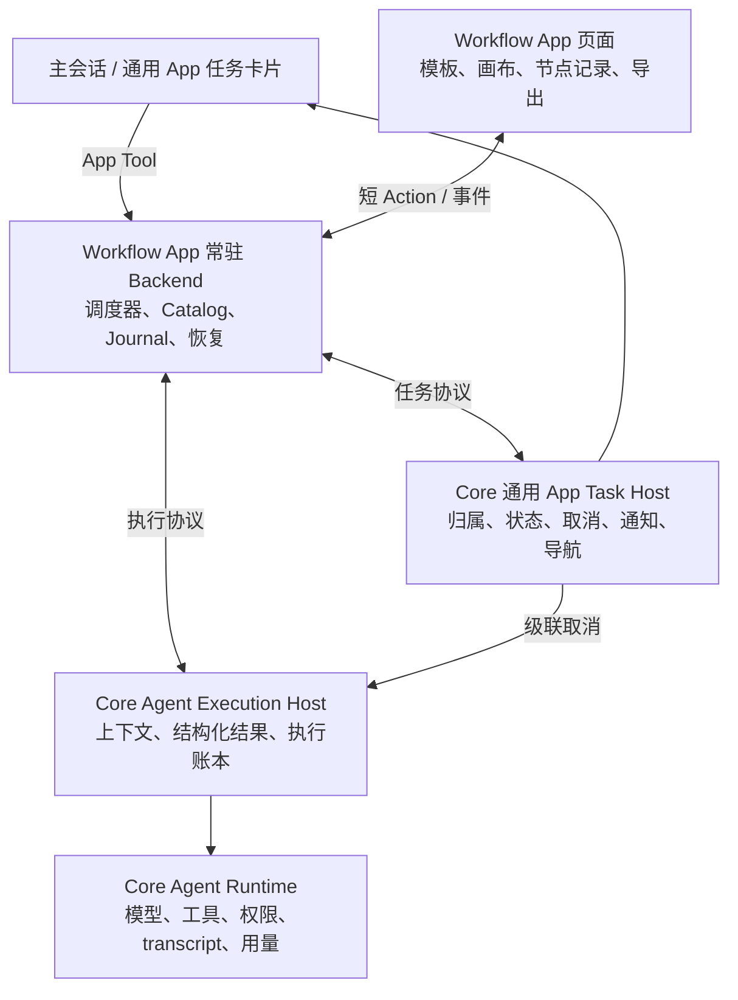

# Workflow 拆分为 App 的实施计划

> 2026-10-09 当前交付：`moss.workflow@0.1.9`、Host API / SDK / Runtime `2.8.0`。用户要求的六项交互调整已实施，详见 [Workflow App 交互调整计划](workflow-app-experience-plan.md) 第 10–12 节。Core 旧 Workflow 源码、历史扫描、工具注册及独立设置已完整移除。旧数据迁移、模板、人工 JSON 编辑器、App 直接新建并运行及聊天大任务卡片均已退出当前产品。下方第 1–13 节记录 0.1.6 及以前的拆分设计/交付过程；与新交互计划冲突的内容仅作历史记录，不再作为当前验收要求。

历史状态（0.1.6）：Desktop 本地交付更新至 App `moss.workflow@0.1.6`、Host API `2.7.0`；review 的 R1–R8 已补齐实现与针对性验证，跨平台和完整故障矩阵仍按实际证据验收。更新：2026-10-09。实际实现范围见第 12 节，[整体复核与阻塞项](workflow-app-review.md) 及第 13 节优先于下方原设计目标与进度描述。

目标：将 Workflow 拆为第一方 `moss.workflow` App，由 App 拥有流程定义、模板库、画布、调度和恢复；Moss Core 提供通用 Agent 执行、权限、上下文、资源限制和任务生命周期。

实施顺序：**固定行为基线 → 解耦引擎 → 补齐 Host API → 迁移 App → 数据迁移与集成验证 → 切换和清理**。不先删除旧入口，也不长期保留两套调度器。

## 1. 范围与首版约束

- App 源码放在相邻 `moss-apps` 仓库的 `apps/workflow/`，沿用已有 App 的构建、校验、签名和市场发布链路。
- 首版承接当前 Desktop 本地 Workflow Definition v3，保留现有节点、权限、上下文复用、取消和恢复语义。
- Core 不解释 `condition`、`parallel`、`join`、`foreach`、回边或子流程；Core 按通用执行任务管理资源和取消关系。
- App 后台为 `persistent` Node 进程。关闭页面继续运行；退出 Moss 后保存中断状态，下次启动核对执行状态后恢复。
- 首版保留只读流程画布及自然语言创建、编辑、使用流程。拖拽编排器、新节点类型、任意层级嵌套和自动重试策略另行规划。
- 远程会话、服务端独立调度、定时触发和跨 App 直接 Action 节点不纳入首版。当前 Workflow 明确不支持 server，现有 App Agent 接口也仅接入本 App 的本地会话。
- 不迁移不兼容的 Definition v1/v2。有效 v3 模板和运行记录纳入迁移范围；异常记录输出具体迁移结果。
- 用户已授权本地安装、迁移与 CDP 测试。公共市场发布未执行。

## 2. 已核实的现状

| 功能 | 当前实现 | 拆分处理 |
| --- | --- | --- |
| Definition、图校验、Mermaid | [definition.ts](../../src/utils/workflows/definition.ts)、[graph.ts](../../src/utils/workflows/graph.ts) | 移入 App engine |
| 状态机、数据绑定、并发、循环、foreach | [runtime.ts](../../src/utils/workflows/runtime.ts)、[limiter.ts](../../src/utils/workflows/limiter.ts) | 移入 App；去掉 Core 上下文依赖 |
| Code 编译与确定性约束 | [compile.ts](../../src/utils/workflows/compile.ts) | 移入 App，维持同步、无文件/网络/模块访问等限制 |
| Agent 调用与逻辑节点会话 | [harness.ts](../../src/utils/workflows/harness.ts)、[runWorkflowAgent.ts](../../src/utils/workflows/runWorkflowAgent.ts) | 调度状态归 App；执行实现抽为 Core 通用服务 |
| 模板、不可变 revision、发布、目录发现 | [catalog.ts](../../src/utils/workflows/catalog.ts)、[discovery.ts](../../src/utils/workflows/discovery.ts)、[save.ts](../../src/utils/workflows/save.ts) | 移入 App，注入存储根和明确的项目来源 |
| 结果缓存、Journal、运行快照 | [journal.ts](../../src/utils/workflows/journal.ts)、[paths.ts](../../src/utils/workflows/paths.ts)、[LocalWorkflowTask](../../src/tasks/LocalWorkflowTask/LocalWorkflowTask.ts) | App 管业务记录；Core 保留执行账本与 transcript |
| 四个工具与斜杠命令 | [WorkflowTool](../../src/tools/WorkflowTool/WorkflowTool.ts)、[WorkflowCatalogTools](../../src/tools/WorkflowTool/WorkflowCatalogTools.ts)、[createWorkflowCommand](../../src/tools/WorkflowTool/createWorkflowCommand.ts) | App contributions；兼容层只做入口转发 |
| 工作流库、草稿、运行画布 | [workflow-library-view](../src/renderer-react/components/workflow-library-view.tsx)、[workflow-graph-panel](../src/renderer-react/components/workflow-graph-panel.tsx)、[workflow-canvas](../src/renderer-react/components/workflow-canvas.tsx) | App 页面；聊天区改用通用任务卡片 |
| 后台任务、通知、停止、历史 | [launchWorkflow](../../src/tools/WorkflowTool/launchWorkflow.ts)、[session-task-service](../src/session-task-service.mjs)、[session-control-ipc](../src/session-control-ipc.mjs) | 增加通用 App 任务适配器，替换 `local_workflow` 分支 |
| UI IPC 与设置 | main.mjs、preload.mjs、App.tsx、chat-area.tsx、app-sidebar.tsx、desktop-settings.mjs | 清理 `workflow:*`、原生页面与用户级重复开关 |

需要以代码为准的细节：

- `test` 与 `run` 执行同一份固定定义，差别是历史标记，不是无副作用的模拟执行。
- 画布设置了 `nodesDraggable=false`、`nodesConnectable=false`，当前没有可迁移的拖拽编辑能力。
- 子 Workflow 目前只支持一层；foreach body 不支持嵌套 foreach。
- `pluginWorkflows.ts` 当前返回空数组，不能把完整插件模板加载当作已支持能力。
- `runtime.ts` 虽可注入 `runAgentImpl`，仍通过 harness 依赖 `ToolUseContext`、`canUseTool` 和 Core 状态，需要继续解耦。
- Workflow Agent 通过 `assembleToolPool` 重新取得内置和 MCP 工具；主会话的 App Tools 是另外注入的。统一执行接口必须验证动态 App Tools 的继承与过滤。

## 3. 目标架构与职责



| App 决定 | Core 决定 |
| --- | --- |
| 哪个节点就绪、下一条边、数据绑定、汇合规则 | 是否允许执行、工具授权、实际资源上限 |
| 工作流并发目标、回边次数、节点预算、子流程关系 | 全局/任务组并发和预算硬限制、执行截止时间 |
| 业务结果是否 `blocked`、是否按用户要求重试 | Agent 执行是否成功、是否取消、结构化结果是否合规 |
| 节点实例、逻辑会话键、Definition 快照、缓存结果 | 可复用上下文句柄、transcript、执行 ID、实际用量 |
| 详细流程图、节点历史、导出文件 | 主会话简要任务卡片、权限请求、完成通知、跳转 App |

Code 节点继续使用显式绑定输入和确定性执行环境。App Backend 的 Node 权限不应直接暴露给脚本；Code 执行使用独立 worker 和有界超时，避免长同步脚本阻塞取消请求和后台心跳。Node `vm` 不作为操作系统级安全沙箱宣传。

Agent、Tool、Skill、Connector 的选择由 App 请求，Core 根据当前用户、来源会话和安装 grants 再次校验。节点不能通过调用 App 自己的编排工具绕回调度器；禁止嵌套编排需要覆盖内置工具和动态贡献工具。

## 4. 通用 Host API 设计

以下名称和字段是拟新增契约，阶段 P0 固定后再实现。建议 Host API 升级到下一个兼容 minor（当前为 2.6，拟 2.7），App 声明最低版本。同步 SDK、Runtime 依赖、声明文件、Manifest 校验、UI 版本声明和 `moss-apps/vendor/moss-core` 快照；不能只修改文档版本。

保留现有 `moss.agent/v1` 的渠道语义与兼容性。新增 `moss.agent-execution/v1` 和 `moss.tasks/v1`，所有方法复用现有协议声明、grants、App/实例、owner、generation 和 launch token 校验。协议不得暴露任意 Core 模块、数据库查询或 `ToolUseContext`。

### 4.1 可信来源与执行上下文

在 Host 创建 App Tool、命令或页面 Action 时，向 `AppActionContext` 注入可信 `invocation` 描述及不透明 `launchRef`。它记录来源会话/工具调用或独立页面来源，但不是模型可填写的工具参数。

- 主会话发起：Host 从真实调用上下文解析稳定会话、工作区、Agent 资源与权限。App 只能引用句柄及收窄资源，不能提交任意父会话 ID、权限模式或 system prompt。
- App 页面发起：Host 建立独立任务上下文并提供权限展示入口。需要关联已有会话或选择项目时，由 Host 处理用户可见的选择及校验，不按“当前活跃会话”隐式绑定。
- `task.create` 将短期来源引用转换为持久任务及 `scopeRef`；后续执行不依赖原 Action 保持打开。
- `scopeRef` 绑定 App、实例、owner、任务和已授权来源。App 重启后通过任务查询重新取得可用引用，每次执行仍校验当前 generation 和授权。
- 持久记录保存稳定 ID 与策略来源，不保存函数、AbortController 或运行时对象。Core 在恢复时重新解析执行上下文。
- 源会话被删除、身份切换或授权撤销时使相关 scope 失效。App 的旧引用不能重新启动 Agent。
- 主会话原本由用户选择的完全放行模式可以由 Host 按来源继承；App 无权自行请求或升级为 `bypassPermissions`。独立页面任务沿用用户当前授权规则。

### 4.2 `moss.agent-execution/v1`

| 方法 | 主要输入 | 输出与语义 | 拟定权限 |
| --- | --- | --- | --- |
| `capabilities` | `{}` | 环境、协议能力和限制；首版仅本地 | `execution:read` |
| `execution.start` | `scopeRef`、`idempotencyKey`、`contextKey`、`prompt`、`outputSchema`、可选 `agentType/resources/timeoutMs` | 快速返回 `executionId/contextRef/status`，持久接受后后台执行 | `execution:run` |
| `execution.get` | `executionId` | 状态、结构化输出或 `resultRef`、错误码、用量、进度游标 | `execution:read` |
| `execution.list` | `taskId`、分页游标 | 仅本 App/实例有权访问的任务执行记录 | `execution:read` |
| `execution.cancel` | `executionId`、原因 | 幂等取消，等待中的权限请求也结束 | `execution:cancel` |
| `execution.events` | `executionId`、`afterSequence`、`limit` | 补取持久事件；实时事件只是低延迟通知 | `execution:read` |
| `execution.result.read` | `resultRef`、分页参数 | 读取有界结果分片；结果引用保持相同归属校验 | `execution:read` |

执行状态为 `queued → running / waiting_permission → completed / failed / cancelled / interrupted`。终态不可被迟到事件覆写。

契约要求：

1. `contextKey` 是任务范围内的不透明逻辑键。同一节点的循环访问复用同一上下文，不同节点/foreach 项使用不同键；同一上下文执行串行，不同上下文可并发。
2. Core 持有 transcript 并提供结构化输出能力。Workflow 的 `{status: completed|blocked, ...}` 包装由 App 作为普通 `outputSchema` 提交；Core 不解释业务 `blocked`。
3. `resources` 只能收窄。保留命名 Agent 的指令和可用资源，正确合并内置、MCP、App Tools，并将禁止嵌套编排作为可校验的通用执行策略。
4. `idempotencyKey` 在 App/实例/任务范围持久唯一；同键同请求返回已有执行，不同内容报冲突。传输 request ID 不能替代业务幂等键。
5. 事件提供稳定 `eventId/sequence/executionId`；包含执行状态、工具摘要、权限等待、增量用量和完成结果引用。大结果、日志和 transcript 不塞入 1 MiB IPC envelope。
6. 实际用量只由 Core 记录。App 展示业务统计，Core 按父任务组聚合及限制，子流程不能获得一份独立预算绕过父限制。
7. 正常 Action 返回不取消已接受执行；显式取消任务、权限撤销、超时和用户停止才进入取消链路。
8. Host 崩溃后不能将旧 `running` 标记成成功。恢复先核对持久执行记录和实际运行器，无法确认的执行标记 `interrupted`，不自动重复有副作用的工作。

### 4.3 `moss.tasks/v1`

| 方法 | 语义 | 拟定权限 |
| --- | --- | --- |
| `task.create` | `launchRef + idempotencyKey + title + route` 创建任务，返回 `taskId/scopeRef/revision/limits` | `tasks:write` |
| `task.get/list` | 查询状态、当前 attempt、scope、摘要和 App 路由 | `tasks:read` |
| `task.update` | 按 revision 更新进度摘要；不能伪造 Core 用量或复活终态 | `tasks:write` |
| `task.finish` | 提交成功/失败结果摘要及资源引用；成功前核对执行已结束 | `tasks:write` |
| `task.cancel` | 持久记录取消，禁止新执行，并直接取消其 Core 执行 | `tasks:cancel` |
| `task.resume` | 显式恢复中断任务，创建新的 attempt，保留旧记录并重新校验来源及资源 | `tasks:write` |

任务事件至少包含 `task.cancel_requested`、`task.scope_invalidated` 和状态变更。App 不在线时，Core 的取消仍生效；Backend 恢复后先对账再继续。Core 对任务完成通知使用持久 outbox 和去重键，保证结果不会因主会话暂时没有正在运行的任务而漏投递。

主会话使用通用 `app_task` 视图显示标题、状态、简要用量、停止和“打开 App”。Core 只保存 App ID、通用任务字段及经验证的 App 内路由，不读取流程图。`task.route` 必须归属于该 App，不能携带任意执行代码或外部导航目标。

### 4.4 取消、重启和预算边界

| 事件 | 预期处理 |
| --- | --- |
| 关闭 App 页面、主会话正常结束一轮回复 | 后台流程继续 |
| 用户停止来源会话或单个任务 | Core 立即禁止新增执行并取消在途执行；App 停止调度 |
| 用户在 App 显式重试某个失败节点 | 新 attempt 使用新幂等键；上下文复用遵循已固定的原有语义 |
| Backend 意外退出 | Core 标记任务中断并有界取消在途执行；重启对账，不凭 App 内存重发 |
| Moss 退出或崩溃 | 保存可恢复状态；启动后核对执行账本与 Journal，不能假设外部操作可安全重放 |
| 停用、撤权、卸载 | 先失效执行 scope 并停止任务，再结束后台；已停用 App 不自动恢复任务 |
| App 升级 | 首版要求运行任务先结束或取消，不做运行中调度器热替换 |
| 达到预算、调用数或截止时间 | 拒绝新节点；在途执行按确定的硬限制停止，保留已完成结果 |

业务完成和取消同时到达时，Core 使用 revision/终态判断决定结果，不能出现已取消后重新成功。持久化和幂等只能防止重复派发，不能承诺外部工具副作用严格执行一次。

## 5. Workflow App 结构与对外能力

```text
moss-apps/apps/workflow/
├── app.moss.json
├── schemas/
├── src/
│   ├── engine/          # Definition、图、绑定、调度、Code worker
│   ├── backend/         # Actions、运行管理、Host 适配器、生命周期
│   ├── storage/         # Catalog、revision、Journal、迁移、导出
│   └── ui/              # 模板库、草稿、运行画布与节点详情
├── tests/               # 引擎、存储、协议、取消与恢复
└── scripts/             # 构建、实际 ZIP 集成验证、浏览器验证
```

- Manifest：`id=moss.workflow`，单一导航入口、单 Backend、`lifecycle=persistent`、Node 产物；使用新执行/任务协议和必要的现有文件协议。
- 引擎通过 `AgentExecutor`、`RunStore`、`CatalogStore`、事件回调与取消信号工作，不导入 Core 内部文件。Core 原始 Agent 运行代码不随 App 打包。
- 引擎依赖方向为 UI/Backend → engine/contracts；engine 只依赖运行时无关的合同及注入适配器。实现可先在原目录抽离，切换后 App 成为唯一维护源。
- App 私有数据保存 Catalog 索引、不可变 revision、运行清单、节点事件、结果缓存和导出。明确选择的项目来源保持现有项目覆盖优先级及 `.moss/workflows` 文件互通；不扫描所有仓库或假定进程 cwd 就是用户项目。
- 模板按名称运行时，先解析并锁定具体 revision/内容摘要，再启动；子 Workflow 也必须在本次运行中固定版本。旧行为与此处要求存在差异时，在 P0 记录并单独验证。

### 页面 Actions 与 AI Tools

| 入口 | 能力 | 注册方式 |
| --- | --- | --- |
| `catalog.list/get` | 模板与 revision 查询 | 页面 Action；AI 通过管理工具访问 |
| `draft.create/edit` | 创建或完整替换 Definition，使用 baseRevision 防冲突 | Action + AI 工具 |
| `catalog.manage` | 发布、取消发布、复制、归档、恢复、删除 | Action；按操作效果拆分 AI 工具 |
| `run.start` | 持久创建运行并快速返回 runId/taskId，后台执行 | Action + AI 工具 |
| `run.get/list/events` | 状态、结果、分页事件与历史 | 页面 Action；AI 可查询结果 |
| `run.cancel/resume` | 显式停止或恢复 | Action + 对应写操作工具 |
| `export.*` | Definition、Mermaid、Graph、Run JSON | 页面 Action |

保留创建、编辑、运行、管理四类用户能力；具体 AI 工具按 `read/write/destructive` 分开声明。当前 App Tool 的 effect 是静态属性，不能把 `delete` 放进标记为只读或普通写入的通用工具。工具名称使用标准 `app__...` 命名，安装和管理页展示效果。

`run.start` 只完成校验、持久化及任务登记，不等待完整流程。调度循环脱离 Action 生命周期运行，并使用 Backend 级 Host 客户端；不能继续持有已结束 Action 的请求上下文。查询/取消 Actions 不等待节点结束。事件先落盘，再推送，页面重连可用游标补齐。

App 进入常驻状态后发送 `service.ready`，再进行有界恢复和进度上报，不把网络/模型调用放进启动握手。

### 聊天与命令兼容

- 新建/编辑通过 App AI Tools；模板详情的“在会话中使用”通过通用 Host 导航/输入交接能力实现，不新增 Workflow 专属 renderer IPC。
- App 贡献工具接入现有按需加载、权限请求和工具发现。兼容期的旧 `Workflow*` 入口只转发同一 App 实现，避免双注册和重复执行。
- 已发布模板的 `/name` 需要通用 App 命令发现与 Host 校验；Manifest 已有 commands 声明不代表动态模板命令已完整接入聊天。P3 补齐与验证动态来源、命名冲突、停用移除及刷新。
- 不把恢复的旧 transcript 中出现的 `WorkflowRun` 工具调用再次执行；兼容只针对新的显式调用。
- App 缺失或停用时保留可读的历史卡片与安装/启用入口，不重新启用 Core 调度器作为隐式 fallback。

## 6. 存储、迁移和恢复

### 6.1 迁移来源

| 来源 | 迁移内容 | 处理方式 |
| --- | --- | --- |
| 用户 `workflows/.catalog` 与已发布 `.workflow.json` | 有效 v3 模板、revision、状态、发布文件及来源 | 保留稳定 ID；冲突通过来源命名空间和映射表处理 |
| 明确关联项目的 `.moss/workflows/.catalog` 与模板文件 | 项目模板及覆盖关系 | 按已知/用户选择项目导入索引，保留项目来源与文件互通 |
| 会话下 `workflows/*.run.json`、定义快照、Journal | 运行历史、节点结果、版本、来源会话 | 导入 App 运行记录并建立通用任务历史索引 |
| Agent transcript 与 sidecar | 恢复所需 Agent 上下文及来源 | 留在 Core，由经过归属校验的上下文引用连接 |
| 内置模板 | 可复用 Definition | 随 App 发布并记录来源版本 |
| 用户设置与组织策略 | 规模提示、资源限制、启用状态 | 用户业务偏好迁入 App；组织硬限制保留在 Core 通用策略 |

已有桌面开关不自动授予 App 新权限；原先关闭的能力不能因迁移被静默启用。安装后的唯一用户级总开关采用 App 启停，组织禁用/环境禁用要求映射为 Core 通用执行策略或兼容检查，并验证不会被新入口绕过。

### 6.2 迁移步骤

1. 枚举已知存储根与会话映射，生成清单、源摘要和目标版本。旧运行任务未结束时禁止切换，不复制正在变化的运行记录作为完整快照。
2. 通过临时的第一方迁移适配器导出受限快照到 App staging 区。它只处理已知旧格式，不开放任意路径读取或数据库查询；将来可收敛为离线迁移工具。
3. App 校验 Definition、revision 关联和 Journal；记录 `sourceNamespace + originalId + revision + digest`，逐项幂等导入。
4. transcript 不由 App 直接读取。迁移适配器向 Core 登记经过归属校验的旧上下文引用；恢复时仍需新的任务 scope 和有效授权。
5. 用原子替换提交目标索引和迁移标记；失败保留旧数据，重试不覆盖已编辑的新 App 记录。
6. 核对模板数、revision 数、状态、来源、运行结果和恢复能力；输出失败/跳过项及具体原因。只有验证完成才切换读取入口。

源文件保留作为回滚和导出依据。切换后 App 是活跃目录的唯一写入方，禁止 Core/App 双写。项目文件外部变化按内容摘要检测，保留当前版本冲突保护，不以文件时间静默覆盖 App revision。

### 6.3 运行恢复协议

每次运行保存根 Definition 快照、子流程版本、输入摘要、引擎版本、taskId/attempt、逻辑 contextKey、节点实例和 executionId。

- 派发前持久写入节点意图及稳定幂等键；请求确认后记录 executionId；请求结果不确定时用同键向 Core 对账。
- 完成结果先在 Core 持久，再由 App 提交节点结果与事件；重复完成事件按 ID/sequence 去重。
- 恢复时先查询 Core：完成则复用结果，在途则关联等待，已取消则结束，状态不确定则标记中断。不得仅因为 App 没有结果就重新派发。
- 保留稳定节点实例、配置和解析输入一致时复用结果的原语义；Code/条件在确定性约束下重放。
- `run.resume` 是显式操作。用户主动取消、停用、撤权后不自动恢复。缺少旧 transcript、项目已移除或源记录损坏时标明不可恢复原因，仍允许查看历史或显式发起新运行。
- 重试某次失败执行使用新的 attempt/幂等键；旧 attempt 永久保留，不能改写成新的成功记录。

## 7. 分阶段任务与合入门槛

| 阶段 | 工作 | 交付物 | 完成门槛 | 依赖 |
| --- | --- | --- | --- | --- |
| P0 行为与接口基线 | 固定现有行为、差异清单、协议 schema、迁移 fixture、旧入口兼容期限 | 契约文档、行为矩阵、代表性样例 | 每项现有能力有归属及验收项；所有阻塞接口已有明确语义 | 无 |
| P1 引擎解耦 | 拆出纯 Definition/图/调度/Code；注入 Agent、存储、预算和事件适配器；旧实现仍可运行 | 可独立测试的 engine、旧 Core 适配器 | 引擎不导入 Tool/Task/会话全局状态；现有行为测试通过 | P0 |
| P2 Core 通用能力 | 实现任务与执行协议、可信来源、上下文复用、结构化输出、账本、事件、权限和取消 | SDK/Runtime/Host 服务及集成测试 | 独立测试 App 可并发执行、查询、复用上下文、取消和恢复，无 Workflow 依赖 | P0；适配 P1 |
| P3 App 完整接入 | Backend、Catalog、Journal、工具、模板命令、画布、任务卡片、主题与导出 | 可安装 `moss.workflow` ZIP | 页面关闭仍运行；AI 创建→编辑→运行→结果回会话可用 | P1、P2 |
| P4 数据与可靠性 | 迁移工具、旧上下文映射、幂等恢复、崩溃/升级/取消竞态、跨版本验证 | 迁移报告、恢复报告、回滚演练 | 有效 v3 数据核对通过；无重复派发和双写；异常项可解释 | P3 |
| P5 切换与清理 | 切换默认入口，移除旧调度/UI/IPC；清理构建依赖；更新文档、兼容层期限 | Core + App 配套版本 | 未安装 App 时普通聊天正常；Core 不含 Workflow 调度实现；验收矩阵通过 | P4 |

阶段可以分别形成小 PR，但 P3/P4 验证完成前不删除旧能力。开发验证使用隔离数据目录，任一真实运行只能归一个执行器。

建议 PR 顺序：行为基线 → engine 解耦 → execution 协议 → tasks/聊天通用集成 → App Backend/存储/工具 → App UI/命令 → 数据迁移及恢复 → 默认切换和旧代码清理。跨仓库 PR 记录依赖的 Core commit、SDK 版本和 App artifact 摘要。

## 8. Core 改动与删除清单

| 区域 | 拟修改内容 |
| --- | --- |
| `packages/app-sdk/src/` | 新协议 schema、客户端方法、类型、权限；扩展可信 Action 来源合同 |
| `packages/app-runtime/src/` | Host 协议注册、持久任务/执行账本、事件重放、后台生命周期取消；复用现有 Action broker |
| `ui/src/apps/` | 新通用 Agent Execution/Task Host 适配器，连接本地 Agent Runtime 与 UI 导航 |
| `src/tools/AgentTool/`、`src/electron-direct.ts` | 抽取通用受控 Agent 执行入口、结构化输出、统一工具池；不把流程节点概念带入接口 |
| `src/Tool.ts`、`AppContributionTool` | Host 注入真实调用来源；用户和模型不能伪造父任务与权限 |
| `src/Task.ts`、`src/tasks/types.ts`、SDK task schemas、sdkEventQueue、任务输出/停止/通知 | 通用 App task 适配及序列化；兼容旧历史读取 |
| `ui/src/session-task-service.mjs`、`session-control-ipc.mjs` | 通用任务归属、历史、停止及事件桥接 |
| `ui/src/main.mjs`、`preload.mjs`、renderer types | 删除 `workflow:*`、目录导出依赖和 Workflow 专用 IPC；迁移器单独隔离 |
| App.tsx、chat-area.tsx、app-sidebar.tsx、settings-view.tsx | 移除原生工作流视图/草稿/运行面板，使用 App 导航与通用任务卡片 |
| `src/utils/workflows/`、`src/tools/WorkflowTool/`、`LocalWorkflowTask/`、WorkflowDetailDialog | App 取得唯一实现后移除；必要历史解析留在有期限的兼容目录 |
| tools.ts、commands.ts、constants/tools.ts、PermissionRequest、CLI task 展示 | 移除硬编码工具和命令来源，保留普通 Agent/Task 行为；旧别名仅转发 |
| scripts/features.js、desktop-settings、配置 schema、SDK 设置注入 | 清理旧用户开关和编译开关；组织/环境禁用策略先完成替代 |
| workflow CSS、ReactFlow/Dagre 等依赖 | 检查全仓其他使用者，只有无引用时才移除 |
| `docs/workflows.md`、App/Host/Agent 文档、构建与打包脚本 | 更新职责、入口、协议、版本要求和开发命令 |

`src/utils/worktree.ts`、旧 transcript 元数据中的 Workflow 标识可能服务历史清理与兼容；按行为审查，不能仅按关键词批量删除。

## 9. 验收矩阵

| 范围 | 必须覆盖的场景 |
| --- | --- |
| Definition/调度 | 十种节点、条件 default、显式 parallel/join、merge、回边上限、foreach 隔离、单层子流程、非法图和输入/输出校验 |
| Agent 上下文 | 同节点循环复用完整上下文；不同节点/数组项隔离；命名 Agent 保留指令；恢复后仍能复用 |
| 结构化结果 | 完成、业务 blocked、无有效输出、Schema 不匹配、技术失败、超时；不以自然语言成功提示替代节点结果 |
| 工具与权限 | 普通/bypass/dontAsk/deny 等已有模式；工具拒绝终止流程；内置/MCP/App Tools 可见性；编排工具不递归暴露；组织禁用不可绕过 |
| 任务与资源 | 全局/组/节点限制；并发和预算不能由子流程绕过；用量不重复计数；父会话完成回复与显式停止区别处理 |
| 取消竞态 | 请求排队、等待权限、Agent 执行、节点完成、task.finish、Backend 崩溃时取消；停止后无新节点、终态不回退 |
| 幂等与恢复 | start 回包丢失、重复事件、App 已收到但未落盘、Host 已完成但 App 未收到、残缺 Journal、Backend/Moss 重启、状态未知不盲目重试 |
| Catalog/迁移 | 用户与项目同名覆盖、revision 冲突、发布/归档/恢复、固定子流程版本、重复迁移、迁移中断、新旧来源冲突、旧数据保留 |
| 主会话集成 | 自然语言创建/修改/运行、持续进度、停止、完成通知恰当去重、打开指定运行、历史卡片、App 缺失/停用可解释 |
| App Runtime | 真 ZIP 安装、启动 ready、独立窗口/嵌入页、关闭页面继续、Action 不被长 run 阻塞、升级互斥、撤权后旧进程无法执行 |
| UI | 浅/深色、窄窗口、长流程图、循环/并行状态、节点历史与错误、选择复制、导出与进度重连，无 renderer error |
| 环境/兼容 | 本地 macOS/Windows；远程入口清楚标记不支持；现有 Channel Apps 不受新协议影响；普通聊天和其他后台任务正常 |

验证复用现有 `src/utils/workflows/*.test.ts`、WorkflowTool/LocalWorkflowTask 测试与 `ui/tests/workflow-*.test.ts`；迁移后由 App 接管引擎和页面测试。Core 新测试聚焦协议、权限、账本、生命周期和通用任务，避免把流程规则测试留在 Core。

每个 PR 运行受影响测试与类型检查；切换前运行 Core/Desktop 相关测试、Direct/renderer 构建、App `check/test/build`、Manifest/ZIP 校验，以及真实 AppRuntimeHost + Node Backend + Electron 页面验证。测试数据使用临时目录，不使用真实业务流程验证迁移或崩溃重试。

## 10. 发布、切换与回滚

1. 先交付兼容的新 Host 能力，原 Workflow 仍能工作；同时构建并验证 App，市场包声明正确最低 Host 版本。
2. 在隔离环境安装实际 ZIP，完成模板/历史迁移及故障演练。发布记录绑定 Core 版本、App 版本、SDK 快照和 SHA-256。
3. 实际切换前确保旧运行已结束或由用户显式停止；完成快照及迁移报告，再启用 App 入口。旧入口只可转发，不能继续写旧活跃目录。
4. 停用 App 后禁止启动新流程，保留历史及数据；不存在任何绕过 App 启停的 Core 调度回退。
5. 回滚先停止 App 任务并冻结写入，备份 App 数据。回退到旧 Core 使用切换前快照；切换后新增数据通过 v3 导出显式回导，不能自动假定反向兼容。
6. 兼容别名和一次性迁移器的移除期限在 P0 固定。移除前保留可用离线导入路径，历史 transcript 不要求重写。

最终完成标准：Workflow App 可以独立升级流程规则与节点 UI；Core 仅依赖通用任务/执行合同；卸载 App 不影响普通聊天、Agent 工具及其他 App；有效 v3 模板、运行历史及受支持的恢复场景通过验收。

## 11. 执行进度

- [x] 完成代码边界分析及本计划。
- [x] P0：冻结来源兼容、test/run 版本和强制策略基线。
- [x] P1：引擎解耦。
- [x] P2：通用任务/Agent、结果分块、提交幂等和强制策略的针对性测试通过。
- [x] P3：6 个工具、完整创作合同、通用动态命令、名称/文件来源和可信项目默认值。
- [ ] P4：支持范围内的迁移核对、排除报告、重试/长结果等针对性验证通过；第 9 节完整故障矩阵和 Windows UI 不作完成声明。
- [ ] P5：本地切换和配套源码快照完成；旧历史兼容源码物理删除、跨平台验收单独安排。公共发布不在本次范围。

参考：[现有 Workflow v3](../../docs/workflows.md)、[App Runtime](app-runtime.md)、[Host Capability API](app-host-capability-api.md)、[Agent Host API](agent-host-api.md)、[知识库 App 迁移](library-app-migration-plan.md)、[审计 App 迁移](audit-app-migration.md)。

## 12. 实际交付与验证（2026-10-09）

- App 源码：`../moss-apps/apps/workflow`。目录、修订、发布、模板、状态机、Code Worker、Journal、固定子流程快照、画布和历史归 App。运行 Action 立即返回，单实例最多 4 个工作流同时运行。
- 通用接口：`moss.agent-execution/v1` 与 `moss.tasks/v1`，详见 [接口说明](app-execution-host.md)。Core 提供权限、最终工具池、Agent transcript、结果分块、幂等执行、预算和级联停止；不解析 Workflow 图。
- 主会话显示通用 App 后台任务卡片；旧原生工作流导航和开关由 App 入口/安装权限取代。旧 `workflow:*` 仅做 App Action 代理。Core bundle 不再包含 Workflow 状态机、harness、目录写入或 launchWorkflow。
- 本地安装包：`moss-apps/artifacts/moss.workflow/0.1.2/moss.workflow-0.1.2.zip`。实际 Node Backend 集成报告和 CDP 截图位于 `moss-apps/artifacts/moss.workflow/verification/0.1.2/`。
- 本机迁移复制 37 个目录 JSON 文件、69 个 v3 历史文件，原文件保留；16 个不可兼容/不可读取的历史项记录在实例数据的 `migration-v1.json`，未改写源记录。

验证范围：App 引擎 26 项，存储迁移/修订 2 项，Core 通用 Host 6 项，App Runtime/权限/进程恢复/Session 控制 90 项。App 与 renderer TypeScript 检查、Core direct 和 renderer 构建通过。实际 ZIP 在受管 Node 22.22.2 下验证创建/发布/Code、Agent 协议、后台短 Action、取消、Backend 重启与归档恢复。CDP 使用本机真实模型验证结构化 `answer: 42`。

与原设计目标的明确边界：

- 旧 Core 运行历史只读导入；原有未完成运行不直接转成新执行任务。可以从其 Definition 创建新运行。新 App 的中断运行支持恢复，并优先复用 Core 已完成的执行回执。
- 资源选择目前支持通用 `resources.tools` 与 Agent 类型；未增加独立的 skills/connectors 选择 UI。
- 完成通知是桌面通知及通用任务状态更新，不自动开启主会话的新模型轮次。
- 已禁用且不进入构建的旧 Workflow 源文件，以及用于旧历史渲染的类型/画布仍保留。它们没有并行写入/调度入口；物理删除兼容代码应在历史读取策略不再需要后单独完成。
- 当前画布保持只读；远程执行、定时触发、公共市场发布及拖拽编排不在首版范围。

本地回滚：使用应用管理切换已安装版本。迁移保留源数据，不将新 App 数据写回旧 Core 目录；若回滚到旧 Core，需显式导出新的 Definition，避免出现两个写入者。

2026-10-09 用户验收修正：从聊天工具发起时沿用原会话；从 App 独立运行时新建并打开普通会话，使用工作流名称作标题，显示过程与结果，并支持继续聊天。停止和恢复沿用该会话，不创建空的 App Channel 会话。Workflow UI 使用 Moss 相同的主题变量，并监听主题变更；本地版本更新为 0.1.2。

## 13. 整体复核后的修复（0.1.6）

详见 [复核与修复结果](workflow-app-review.md)。第 12 节记录 0.1.2 阶段证据，不覆盖本节新约束。

- 模型入口收敛为 `workflow_read/create/edit/manage/run/remove`；删除类操作保留独立 effect。
- 提交键和输入指纹先持久化，再创建 Host task；传输重试独立于业务身份。恢复保留稳定逻辑键，attempt 独立。
- 正式运行仅使用当前发布版本；测试使用 UI 所选修订。name 使用发布快照；definitionPath/inline 使用明确的独立快照。
- 完整结果、事件和定义保存在 App，协议发送有界预览和资源引用，按 offset 分块/分页；UI 支持翻页和完整导出。
- 强制禁用保留在 Core，App 开关不能覆盖。可信会话工作区通过 SDK readonly source 注入，不能伪造父会话或权限模式。
- 原 Zod schema/authoring prompt 复用，发布前编译/Schema/子流程校验；通用 App listAction 接回 `/名称`。
- migration-v2 可重试核对源/目标摘要，报告所有支持范围内的冲突和排除，不覆盖本地修改；旧未完成历史不自动转换。
- 本地版本与配套源码快照、ZIP SHA-256 绑定，验证目录为 `moss-apps/artifacts/moss.workflow/verification/0.1.6/`。

原方案不合理之处是把“内部 Action”直接当作“用户/模型工具”，以及把主路径运行成功当作全部验收完成。这两点已纠正。Core 的图调度继续留在 App，普通会话继续承接实际运行和结果。跨平台、旧源码物理清理等未执行项保留未勾选。
